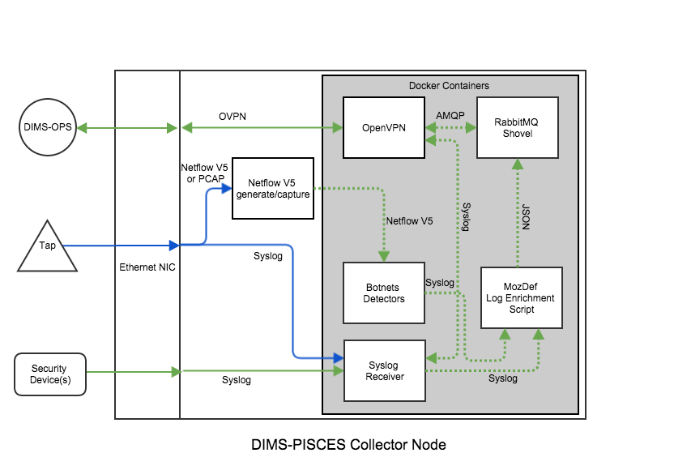

.. _appendices:

Appendices
==========

.. _distributedeventcollection:

Distributed Event Log Collection
--------------------------------

The PRISEM system uses an obsolete (past end-of-life) commercial SEIM
product that collects logs from participating sites, and forwards them
to a central storage and processing system. This is described in
the :ref:`dimsocd:dimsoperationalconceptdescription`, Section
:ref:`dimsocd:prisemcapabilities`, and depicted in this document in
Figure :ref:`PRISEMInitialDeploymentAndFlows`.

The data flow used in the more recent MozDef system was described in Section
:ref:`conceptofexecution`. MozDef uses Python scripts for enrichment of
incoming event logs, optionally received via AMQP (using RabbitMQ) (see
`MozDef Concept of Operations`_).

.. _MozDef Concept of Operations: http://mozdef.readthedocs.org/en/latest/introduction.html#concept-of-operations

.. _proposeddimspisces:

Proposed DIMS-PISCES Collector Architecture
~~~~~~~~~~~~~~~~~~~~~~~~~~~~~~~~~~~~~~~~~~~

To replace this distributed log collection system with an open source
alternative, the features of RabbitMQ known as `Federated Queues`_ and
`Distributed RabbitMQ brokers`_ (specifically, the `Shovel plugin`_),
implemented in Docker containers like other DIMS components, can be
used. This architecture is depicted in Figure :ref:`proposedcollector`.

.. _Federated Queues: https://www.rabbitmq.com/federated-queues.html
.. _Distributed RabbitMQ brokers: https://www.rabbitmq.com/distributed.html
.. _Shovel plugin: https://www.rabbitmq.com/shovel.html
.. _proposedcollector:

   Proposed DIMS-PISCES Collector Architecture

..

The mechanisms for implementing this distributed collection archicture using
RabbitMQ are described in:

+ `Alvaro Videla - Building a Distributed Data Ingestion System with RabbitMQ`_, YouTube, Jul 16, 2014
+ `Distributed log aggregation with RabbitMQ Federation`_, by Alvaro Videla, December 17, 2013
+ `Routing Topologies for Performance and Scalability with RabbitMQ`_, by Helena Edelson, April 1, 2011

.. _Alvaro Videla - Building a Distributed Data Ingestion System with RabbitMQ: https://youtu.be/EUfSgYU_SFk
.. _Routing Topologies for Performance and Scalability with RabbitMQ: http://spring.io/blog/2011/04/01/routing-topologies-for-performance-and-scalability-with-rabbitmq/
.. _Distributed log aggregation with RabbitMQ Federation: http://jaxenter.com/distributed-log-aggregation-with-rabbitmq-federation-107287.html

As described in `Distributed log aggregation with RabbitMQ Federation`_, the relationship
between participant sites with the DIMS-PISCES collector is one of `upstream`
exchanges, which will feed the central DIMS-PISCES backend data store
acting as a `downstream` exchange via the RabbitMQ `Shovel plugin`_.

.. _upstreamdownstream:

.. figure:: images/alvaro-1.png
   :width: 50%
   :alt: Relationship between Upstream and Downstream Exchanges
   :align: center
   :name: Relationship between Upstream and Downstream Exchanges

   Relationship between Upstream and Downstream Exchanges

..

.. _upstreamenrichment:

Upstream Enrichment
-------------------

Certain types of information that are related to the site where
the upstream exchange is located make sense to be included by
the producer scripts when queueing events at the upstream for
later transport to the downstream exchange.  These would be
things like geolocation from an off-line database (e.g., Maxmind),
and tagging with the SiteID, etc.

.. todo::

    Describe how the event logs at an upstream participant site are collected,
    processed, and forwarded to the central backend data store.  These steps
    are:

    #. Parsing from Unix ``syslog`` format to JSON.

    #. Enrichment with site-specific information:

        #. Adding participant *SiteID*.

        #. Mapping of RFC 1918 addresses to routable (i.e., post-NAT)
           address(es).

        #. TLP tagging(?).

    #. Publishing to AMQP upstream exchange for local queueing
       and forwarding to downstream exchange for insertion into
       backend data store.

    .. note::

       Logs for the DIMS-PISCES system processes and security systems should
       themselves be enriched with *SiteID* and identified as being DIMS-PISCES
       related to separate them from other security event logs.  This allows
       for monitoring of the health of the DIMS-PISCES system itself.  These
       events are otherwise processed identically to security events to
       simplify the design of the system.

    ..

..

.. todo::

    .. attention::

        Tuning of RabbitMQ queues should take into account the number of events
        received per collector per day, times the number of days of network
        outage that would be tolerable, in order to avoid losing events. If we
        can determine these numbers from the existing PRISEM system, or derive
        it from historical log data, that would help with tuning.

    ..

..

.. _downstreamenrichment:

Downstream Enrichment
---------------------

Other types of data *do not make sense* to add at the upstream, most notably
data that resides at the central backend data store (e.g, data held in the
Collective Intelligence Framework (CIF) database, which was described in
Section :ref:`dimsocd:currentsystem` of the
:ref:`dimsocd:dimsoperationalconceptdescription`.) In order a producer to tag
data using information stored remotely, the producer would have to make a
remote query for the data, then insert it, then queue the event log data.  This
requires that this added data transit the network twice (once in response to
the query for it, and again when the event log is transmitted from upstream
exchange to downstream exchange.)

It makes more sense to insert a consumer on the downstream exchange that does
this enrichment using locally available data, then index it in the backend data
store.

.. todo::

    Describe how the event logs are enriched at the downstream collection
    point before being indexed in the backend data store.

    These steps for enrichment at the downstream collector would include:

    #. Enrichment of security event data with data available in the Collective
       Intelligence Framework (CIF) database.

    #. Enrichment of DIMS-PISCES system monitoring data with system-specific
       attributes (e.g., TTL or expiration date).

..

.. _collectorrelated:

Related resources
~~~~~~~~~~~~~~~~~

Other web pages that provide alternative methods of collecting log
events in Docker containers include the following:

    + `Automating Docker Logging: ElasticSearch, Logstash, Kibana, and Logspout`_, by Nathan LeClaire, Apr 27, 2015
    + `Scalable Docker Monitoring with Fluentd, Elasticsearch and Kibana 4`_, by manu, November 21, 2014
    + `syslog logging driver for Docker`_, by Mark Wolfe, May 3, 2015
    + `Real-time monitoring of Hadoop clusters`_, by Attila Kanto, October 7, 2014

.. _Automating Docker Logging\: ElasticSearch, Logstash, Kibana, and Logspout: http://nathanleclaire.com/blog/2015/04/27/automating-docker-logging-elasticsearch-logstash-kibana-and-logspout/
.. _Scalable Docker Monitoring with Fluentd, Elasticsearch and Kibana 4: http://blog.snapdragon.cc/2014/11/21/scalable-docker-monitoring-fluentd-elasticsearch-kibana-4/
.. _syslog logging driver for Docker: http://www.wolfe.id.au/2015/05/03/syslog-logging-driver-for-docker/
.. _Real-time monitoring of Hadoop clusters: http://blog.sequenceiq.com/blog/2014/10/07/hadoop-monitoring/
