.. _dimsarchitecturaldesign:

DIMS architectural design
=========================

.. todo::

   This section shall be divided into the following paragraphs to
   describe the DIMS architectural design. If part or all of the design
   depends upon system states or modes, this dependency shall be
   indicated. If design information falls into more than one paragraph,
   it may be presented once and referenced from the other
   paragraphs. Design conventions needed to understand the design shall
   be presented or referenced.

..

Figure :ref:`DIMSSystemArchitecture` illustrates the combined systems
of the PRISEM project, the Trident portal (formerly the *Ops-Trust portal*),
and the DIMS back end. As
much as possible, the DIMS architecture was built to be overlaid on top of, or
merged into, similar components from these existing systems. For
example, it is not necessary to run three DNS servers for each
project, when one can handle multiple systems and possibly even
multiple domains. These can thus be collapsed into one server for
DNS. The same is true for LDAP and OpenID authentication (the
Trident portal and DIMS are both designed to use these services) and there is only
need for one AMQP message bus server, one mail server, and one
database for security data. All access will be centralized through the
OpenVPN server, with certificates and encryption keys provided to the
user via the Trident portal.

.. note::

   This document was originally written prior to the Ops-Trust portal being
   renamed *Trident*. The name *Ops-Trust portal* may still exist throughout
   this, and related DIMS documents. An effort has been made to cross-reference
   the new portal name where possible.

..

.. _DIMSSystemArchitecture:

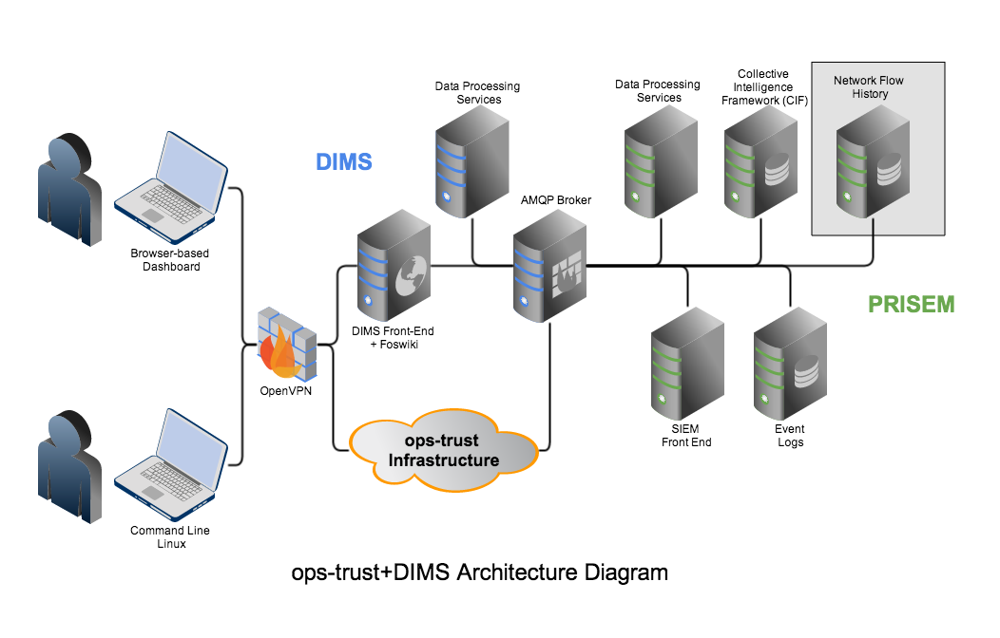

   DIMS Integrated System Architecture

..

.. _dimscomponents:

System Software Architecture
----------------------------

The DIMS system conforms with the hardware/software separation
used by the Trident and PRISEM systems, which pre-date the DIMS
project. In both of these projects, some separation of services across
physical and/or virtual machines was done for various reasons of
security, performance, scalability, ease of administration, conformance
with operating system version dependencies, etc.

SIEM event correlation server
^^^^^^^^^^^^^^^^^^^^^^^^^^^^^

The PRISEM system uses a Log Matrix "Threat Center" system, hosted on
a high-end Dell server with multiple cores, large RAM capacity, an SSD
drive to accelerate database activities, and 2TB RAID 1 array for disk
fault tolerance. This system runs CentOS 6.4.

SIEM log archive server
^^^^^^^^^^^^^^^^^^^^^^^

The PRISEM system uses a Log Matrix "Log Center" system, hosted on a
high-end Dell server with multiple cores, and 9TB RAID 5 array disk
fault tolerance. This system runs CentOS 5.10 (due to compatibility
issues with the Vertica database).

Virtual machine management server
^^^^^^^^^^^^^^^^^^^^^^^^^^^^^^^^^

The PRISEM system uses a Dell PowerEdge R715 for virtual machine hosting.

AMQP broker
^^^^^^^^^^^

The PRISEM system uses a virtual machine running RabbitMQ for AMQP
broker services.

Collective Intelligence Framework (CIF) server
^^^^^^^^^^^^^^^^^^^^^^^^^^^^^^^^^^^^^^^^^^^^^^

The PRISEM system is using a CIF v0.1 database on physical hardware
(Dell PowerEdge 1950). This system will be replaced with a virtual
machine running CIF v1.0 (or newer).

ID management and authentication server
^^^^^^^^^^^^^^^^^^^^^^^^^^^^^^^^^^^^^^^

The Ops-Trust and DIMS projects are using OpenID and LemonLDAP (though
in slightly different ways). The intention is to combine these into a
single pair of OpenID/LDAP servers.

Domain name server
^^^^^^^^^^^^^^^^^^

The Ops-Trust system runs its own DNS server for all system components
in a single-purpose VM. The PRISEM project is currently using static
host tables and DNSMasq in slightly different ways (depending on
whether access is from the open internet, or through the OpenVPN
tunnel). It is anticipated that a split-DNS configuration, using the
same server as the Ops-Trust infrastructure, will be used in the long
run to get consistent DNS response regardless of access method used.

Virtual private network tunnel server(s)
^^^^^^^^^^^^^^^^^^^^^^^^^^^^^^^^^^^^^^^^

The PRISEM project has an OpenVPN server for remote access to the
backdoor VLAN. This allows access to the AMQP broker, and direct
access to the MySQL databases used by Log Matrix. (The vendor
maintains their own Cisco managed VPN/firewall for access from their
internal network).

DIMS components are separated (as appropriate) for similar reasons, and
integrated as much as possible by combining similar services in order to
minimize the total number of physical and/or virtual machines in use. For
example, if there are three domain name servers, they can be combined into one
server that handles multiple domains.

The following Figures help illustrate the concepts of system implementation of
the service components in relationship to physical ("bare-metal") hardware.

Of course the simplest design is to take a hardware system, install a single
operating system on it, and install every piece of software into that single
server.  For the reasons listed above, this is not a viable or practical
solution, since the component pieces were never designed to work this way. The
level of effort required to debug, patch, document, and attempt to get the
original authors to accept the code changes into their code base (to avoid
adding a maintence cost for maintaining your locally patched fork as new
versions of the original software are released) is not sustainable.

Figure :ref:`VM-Architecture` shows the next simplest design, which is to
host multiple virtual machines on a single server.  The *Host* is shown at the
bottom, comprised of a highly-provisioned server, a base operating system and a
virtual machine hypervisor. Each virtual machine *Guest* is then created and
installed with its own combination of base operating system, libraries and
binaries, and application software. The result is a single physical
computer with a total of six servers (4 Ubuntu Linux, 1 Red Hat Enterprise
Linux, and 1 Debian Linux) that must be configured, patched, and maintained
separately. There is also a higher overhead for processing and memory,
due to the hypervisor hardware virtualization layer.

.. _VM-Architecture:

.. figure:: images/VM-Architecture.png
   :width: 70%
   :align: center

   Pure Virtual Machine Architecture

..

Figure :ref:`Container-Architecture` shows an alternative to virtual
machines, which is the use of pure *containerization* of all services. In this
architectural model, the Docker Engine replaces the hypervisor as part of the
Host layer. On top of this are *Containers* formed from images that combine the
foundational operating system bits, libraries, binaries, and application
software as in Figure :ref:`VM-Architecture`, except there is no
virtualization of hardware taking place. Instead, container images hold the
file system contents that are then executed in isolated process spaces that
function similarly to virtual machines (though simpler, as they only provide a
service oriented function, rather than a fully-functional operating system into
which you log in to like a "normal" virtual machine or bare-metal operating
system.) One of the principle advantages to this architectural model is the
separation of content in each container, allowing just the specific base
operating system, binaries and libraries, and application code for each open
source security tool to be set up exactly as the producer supports
with no risk of that breaking other tools that are part of the larger
system.

.. _Container-Architecture:

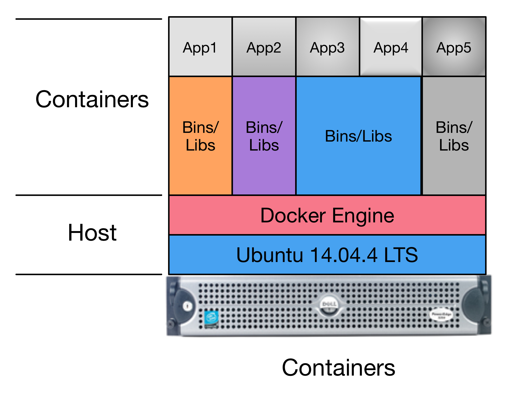

   Pure Container Architecture

..

Of course is it much more complicated than this in real life. Requirements
for scalability and redundancy drive towards use of multiple bare-metal
servers. This leads to two more architectural models to add to the mix.

The first is to clusterize the containerized model we just saw.
Figure :ref:`Clusterized-Containers-Architecture` depicts a two-node
CoreOS cluster. A program ``etcd`` is used as a distributed key/value
store that facilitates managing the distribution and management of
containers across the two server nodes. *App2* and *App3*, in this
case, have multiple instances running (2x App2 and 3x App3, in
this case), both split across the two cluster members.  This allows
one of the two cluster servers to be taken off-line without
disrupting the services provided by App2 and App3.

.. _Clusterized-Containers-Architecture:

.. figure:: images/Clusterized-Containers-Architecture.png
   :width: 70%
   :align: center

   Clusterized Container Architecture

..

The final architectual model is combination of the earlier models.  Figure
:ref:`Hybrid-Architecture` depicts a *Hybrid* combination of bare metal,
virtual machines, and containers within virtual machines. (Because containers
are so light-weight, you can run containers in both the Host and Guests,
containers within containers, or combinations nested within each other!)

The hybrid model can be accomplished by adding virtualized CoreOS nodes
in the form of VM Guests along side other VM Guests in one server (as
shown in Figure :ref:`Hybrid-Architecture`), or splitting pure virtual
machines and pure-containerization across multiple servers (as shown
in Figure :ref:`VMs-Containers-Architecture`).

.. _Hybrid-Architecture:

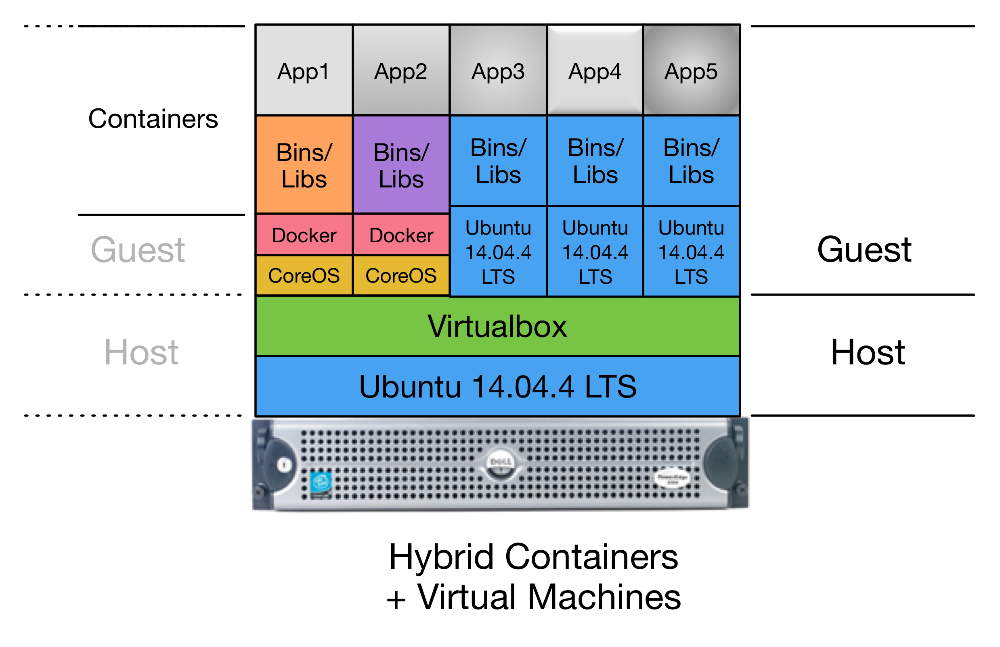

   Hybrid VM+Container Architecture

..

.. _VMs-Containers-Architecture:

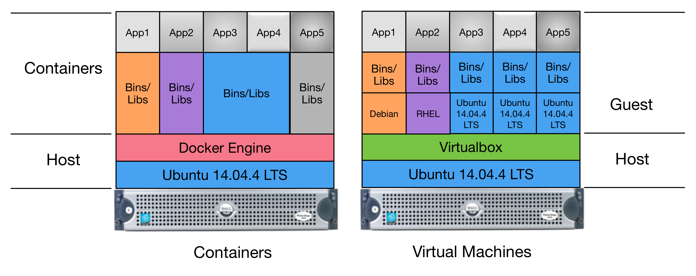

   Multi-server Hybrid Architecture

..

A primary advantage of this architectual model is the ability to use the
separation of virtual machine Guests to leverage operating systems like CoreOS
(that are designed for clusterized containerization support) along side
multiple different base operating systems in other virtual machine Guests,
within a single hardware server. This allows movement of services as
necessary to address performance issues that may be discovered over
time as the system scales up.

.. note::

   The architecture currently being used for DIMS development uses the
   Hybrid model, with a three-node CoreOS cluster on bare-metal servers,
   with a fourth server supporting virtual machine Guests.

   Work is underway to replicate the entire system using a single-server Hybrid
   deployment as shown in Figure :ref:`Hybrid-Architecture` as the prototype
   for the U.S. Secret Service ECTF deployment.

   The ECTF deployment is being planned to be done with two servers with
   a subset of DIMS components (primarily focusing on the Trident portal.)
   One server will be used to provide a stable "production" service platform,
   while the second server can be used for staging new releases, testing,
   supporting migration to other data center facilities, or as a fallback in
   case the first system is damaged.

..

Internal Communications Architecture
------------------------------------

.. todo::

   In this section, describe the overall communications within the
   system; for example, LANs, buses, etc. Include the communications
   architecture(s) being implemented, such as X.25, Token Ring,
   etc. Provide a diagram depicting the communications path(s) between
   the system and subsystem modules. If appropriate, use subsections to
   address each architecture being employed.

..

The DIMS system was designed to overlay on top of the legacy PRISEM
system and other open source security tools. PRISEM had interfaces
to some of its services that integrated
an instance of the Collective Intelligence Framework (CIF) database
for IP-based reputation watchlists and historic attacker context, an
archive of historic event logs, and remotely stored network flow data
in SiLK format. The logical architecture that integrated these systems
is a combination of message bus (using AMQP), SSH tunneled file and/or
command line access, or HTTPS web interfaces and RESTful API.

Figure :ref:`MessageBus` shows the general flow of commands and logged
events from clients and services used in the PRISEM system for
inter-process communication between system components. In this
example, there are three general RPC services named *A*, *B*, and *C*.
Calls from remote clients *A* (color blue) and *B* (color black) are
processed by one of n instances of multiprocessing service daemons on
the same hardware as the AMQP broker (by multiple processes or virtual
machines). Client *C* in this diagram (color green) is also a remote
client, as is the RPC service *C*. (The AMQP broker and RPC mechanism
allows these programs to run anywhere we want.) Also depicted in this
diagram is an event feedback loop (color red). All clients and
services log significant events such as process startup, process end,
time taken to process RPC calls, or even more fine-grained debugging
output to assist developers. These events logs are published to a
fanout exchange, which distributes the events to any subscribers who
wish to consume them.

.. _MessageBus:

.. figure:: images/rabbitmq-bus-architecture.png
   :width: 70%
   :align: center

   AMQP Messaging Bus Architecture

..

Figure :ref:`dims-vpn-vlan1` depicts a high-level view of remote access
from developer laptops (on the right) or servers at a remote site (on
the left) using an OpenVPN tunnel that is routed via Network Address Translation
to a non-public VLAN. This simplistic diagram does not show specific
routable IP addresses of the remote systems, though it does show the
tunnel IP address assigned by OpenVPN in relation to the OpenVPN
server, and the difference between the network address ranges used by
hosts on VLAN1 vs. the OpenVPN tunnel.

.. note::

    In reality, there are multiple non-private network address ranges and VLANs
    in use by Virtual Machine hypervisors, Docker containers, and physical
    switch VLANs. This is described in the "DIMS As-Built" document and we
    are in the process of simplifying the highly-complicated networking
    implementation that resulted from building on top of the legacy PRISEM
    platform that goes back to the project's initiation in 2008.

..

.. _dims-vpn-vlan1:

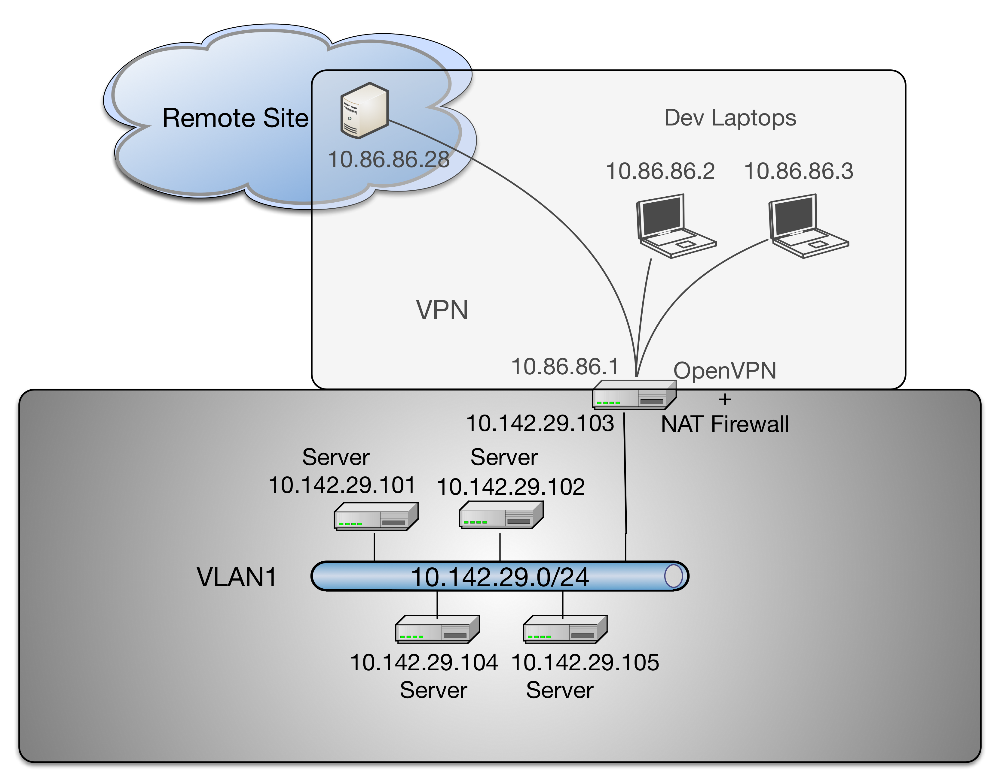

   Remote access via OpenVPN to VLAN1

..

.. _conceptofexecution:

Concept of execution
--------------------

.. todo::

   This paragraph shall describe the concept of execution among the software
   units. It shall include diagrams and descriptions showing the dynamic
   relationship of the software units, that is, how they will interact during
   DIMS operation, including, as applicable, flow of execution control, data
   flow, dynamically controlled sequencing, state transition diagrams, timing
   diagrams, priorities among units, handling of interrupts, timing/sequencing
   relationships, exception handling, concurrent execution, dynamic
   allocation/deallocation, dynamic creation/deletion of objects, processes,
   tasks, and other aspects of dynamic behavior.

..

The problem of event collection, correlation, and alerting, is quite common.
Nearly every anti-virus vendor, managed security service provider, major internet
platform provider, or multi-national enterprise, shares similar problems with
processing event data. They are nearly all looking at the same type of
architecture to handle the high data volumes and flow rates associated with
large, high-bandwidth networks.

A common combination of open source tools used to process and index large volumes of event
logs is *Elasticsearch*, *Logstash*, and *Kibana*, known as the
"ELK stack" for short.  The developers of the ELK stack refer to it [#ES]_ as
"an end-to-end stack that delivers actionable insights in real-time from almost
any type of structured and unstructured data source." Elasticsearch provides
flexible storage of data and flexible search of data. Logstash is used to parse
the data, and then it sends it to Elasticsearch. Kibana then takes the parsed
data from Elasticsearch and presents it through a browser in an easy-to-view
way.  Kibana's dashboards are customizable in a variety of ways to we can
better dissect and view the data.

+ Elasticsearch

.. _Architecture behind our new Search and Explore experience: https://developers.soundcloud.com/blog/architecture-behind-our-new-search-and-explore-experience
.. _How HipChat Stores And Indexes Billions Of Messages Using ElasticSearch And Redis: http://highscalability.com/blog/2014/1/6/how-hipchat-stores-and-indexes-billions-of-messages-using-el.html
.. _Using elasticsearch and logstash to serve billions of searchable events for customers: http://www.elasticsearch.org/blog/using-elasticsearch-and-logstash-to-serve-billions-of-searchable-events-for-customers/
.. _Example configuration of Elasticsearch: https://github.com/aol/moloch#example-configuration
.. _Moloch network flow monitoring tool: https://github.com/aol/moloch
.. _How to use Elasticsearch with Python: http://snippets.aktagon.com/snippets/611-how-to-use-elasticsearch-with-python
.. _Security Analysts Discuss SIEM’S -- Elasticsearch/Logstash/Kibana vs ARCSight, Splunk, and more: http://skizzlesec.com/2014/06/08/security-analysts-discuss-siems-elasticsearchlogstashkibana-vs-arcsight-splunk-and-more/
.. _Scaling an ELK stack at bol.com: http://www.slideshare.net/renzotoma39/scaling-an-elk-stack-at-bolcom-39412550

    + `Architecture behind our new Search and Explore experience`_ (where "our" is Soundcloud... see "final box-diagram")
    + `How HipChat Stores And Indexes Billions Of Messages Using ElasticSearch And Redis`_
    + `Using elasticsearch and logstash to serve billions of searchable events for customers`_
    + `Example configuration of Elasticsearch`_ for AOL's `Moloch network flow monitoring tool`_
    + `How to use Elasticsearch with Python`_
    + `Security Analysts Discuss SIEM’S -- Elasticsearch/Logstash/Kibana vs ARCSight, Splunk, and more`_
    + `Scaling an ELK stack at bol.com`_

+ Logstash

.. _What is Logstash?: http://logstash.net/docs/1.4.2/learn
.. _Github logstash/cookbook: https://github.com/logstash/cookbook

    + `What is Logstash?`_
    + `Github logstash/cookbook`_

+ Kibana

.. _Creating an Advanced Kibana Dashboard Using a Script: http://blog.trifork.com/2014/05/20/advanced-kibana-dashboard/
.. _Templates and Scripts: http://www.elasticsearch.org/guide/en/kibana/current/templated-and-scripted-dashboards.html
.. _Command Line Load Dashboard: https://github.com/elasticsearch/kibana/issues/333

    + `Creating an Advanced Kibana Dashboard Using a Script`_
    + `Templates and Scripts`_
    + `Command Line Load Dashboard`_

.. _Mozilla Defense Platform: https://media.readthedocs.org/pdf/mozdef/latest/mozdef.pdf
.. _MozDef: https://github.com/jeffbryner/MozDef
.. _Bsides PDX 2014 presenation on MozDef: http://jeffbryner.com/bsidespdx2014/
.. _MozDef\: You've collected your security logs, now what?: https://air.mozilla.org/intern-presentations-11/
.. _accompanying slides: http://anthony-verez.fr/mozdef/

The ELK stack has been used to process hundreds of millions to billions of
events per day. Mozilla uses it as part of the `Mozilla Defense Platform`_, or
`MozDef`_. (See Figure :ref:`mozdefdataflows` for the data flow diagram for the
`Mozilla Defense Platform`_, or `MozDef`_.
See also Jeff Bryner's `Bsides PDX 2014 presenation on MozDef`_
and Anthony Verez' presenation `MozDef\: You've collected your security logs,
now what?`_ and `accompanying slides`_.) The company Mailgun has described how
they are `Using elasticsearch and logstash to serve billions of searchable
events for customers`_.  (For an order of magnitude comparison, the PRISEM
system currently collects between 30-60 million events per day, not the
billions described in this reference.)

.. _mozdefdataflows:

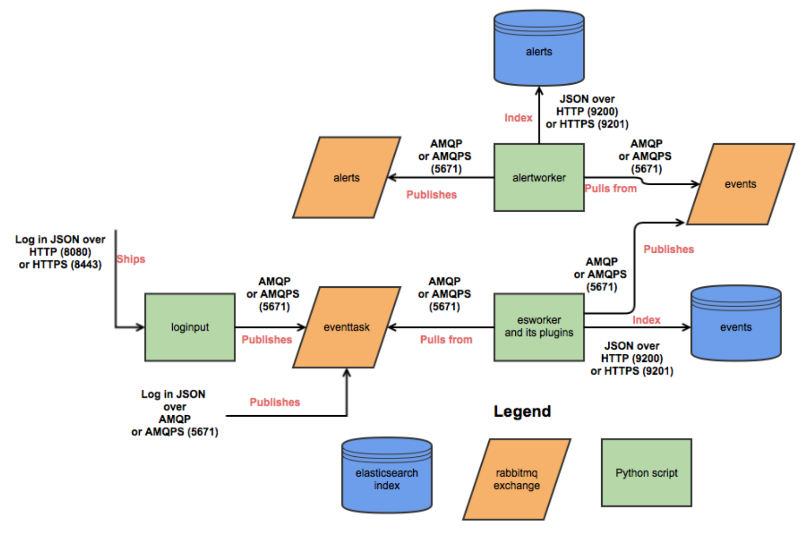

   MozDef data flows

..

Figure :ref:`logstashandmetrics` (source [#metrics]_) shows how the event log
collection process works in terms of data flows between sources and ELK stack
components. The DIMS system is designed to sit on top of such an event
collection infrastructure.

.. _logstashandmetrics:

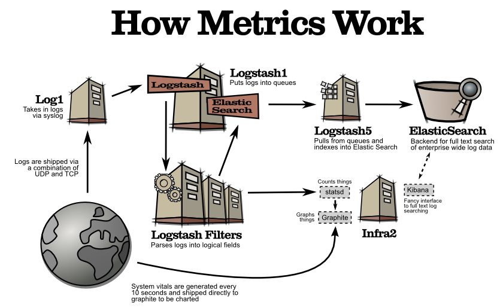

   Logstash and Metrics
   
..

Section :ref:`containerization` discusses `Docker`_ and its role in
implementing a `micro-service architecture`. ELK stack components have been
demonstrated being implemented in containers. (E.g., see `Automating Docker
Logging: ElasticSearch, Logstash, Kibana, and Logspout`_, by Nathan LeClaire
and `Scalable Docker Monitoring with Fluentd, Elasticsearch and Kibana 4`_, by
manu, `Elasticsearch, Weave and Docker`_, by errordeveloper, and the GitHub
repository of `iantruslove/docker-elasticsearch`_ with a Docker image for
ElasticSearch using Maestro orchestration.)

`Real-time monitoring of Hadoop clusters`_ describes deploying the ELK stack
alongside Hadoop cluster nodes to provide a realtime monitoring capability.
(See also `Apache Hadoop 2.6.0 on Docker`_, by Janos Matyas, for containerizing
the Hadoop cluster nodes.)

.. _hadoopmonitoring:

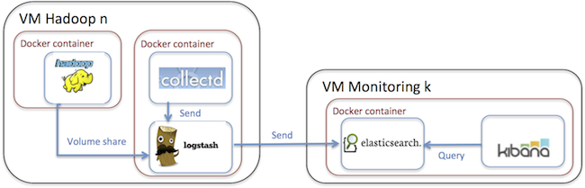

   High-level architecture for monitoring Hadoop with the ELK stack

..

.. _interfacedesign:

Interface design
----------------

.. todo::

   This paragraph shall be divided into the following subparagraphs to describe
   the interface characteristics of the software units. It shall include both
   interfaces among the software units and their interfaces with external
   entities such as systems, configuration items, and users. If part or all of
   this information is contained in Interface Design Descriptions (IDDs), in
   section 5 of the SDD, or elsewhere, these sources may be referenced.

..

File and Database Design
------------------------

.. _PRISEMDataVolumes:

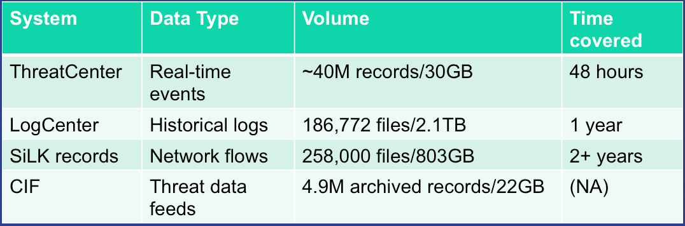

   PRISEM Data Volumes

..

Figure :ref:`PRISEMDataVolumes` lists the database and non-database
data sources used by the PRISEM system, along with the approximate
timespan over which those records are kept.

Database Management System Files
--------------------------------

There is an approximate average of 20M events per day collected by the
ThreatCenter database server (zion.prisem.washington.edu), which is
configured with a 48-hour data retention window. These records are
kept in a database optimized for continuous correlation.  The
normalized records (which include the original raw event log) are
stored in over 167,000 discrete read-optimized Vertica database files
on the LogCenter server (money.prisem.washington.edu).  The Collective
Intelligence Framework database (v0.1) keeps its data in a Postgress
database. This database is used to pull feeds from remote sites, and
to generate feeds for use by the Botnets system’s watchlist
detectors. At regular periods during the day, the CIF database has
some tables copied into a read-optimized MySQL database known as
Sphinx for accelerated discrete queries. (It is the Sphinx database
that is used by the cifbulk RPC service).

Non-Database Management System Files
------------------------------------

Network flow records are stored locally at the City of Seattle
(pink.seattle.gov) in SiLK format. The disk capacity of 1TB is capable
of holding just over 2 years of flow data in over 258,000 discrete
SiLK data files. (SiLK is a highly-optimized fixed length binary
format that is quite efficient for post-processing without needing a
database management system.)

Human-Machine Interface
-----------------------

The raw inputs to PRISEM fall into three primary buckets: event logs
from security devices in text form, which are normalized as they are
processed by the SIEM; Network flow records that are received as
NetFlow V5 records processed in real time and discarded, but a copy is
converted to SiLK format and saved for historic query capability;
reputation data pulled from various feeds and stored in a Collective
Intelligence Framework (CIF) database. Various ad-hoc formats of
“indicators of compromise” or “observables” are received from outside
parties, which are primarily processed by hand (this includes
indicators received from federal government sources, for example Joint
Indicator Bulletins (JIBs) from the Federal Bureau of Investigation).

.. _CiscoFWSM:

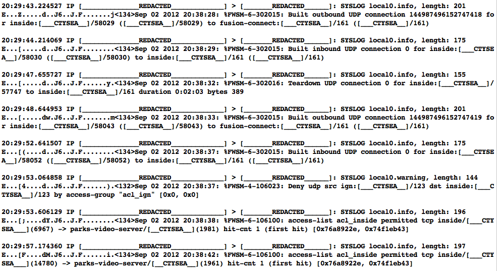

   Cisco FWSM Event Log (Redacted)

..

Examples of standard security device logs can be seen in Figure
:ref:`CiscoFWSM` (Cisco Firewall Security Manager, or FWSM), Figure
:ref:`Netscreen` (Netscreen Firewall), Figure :ref:`TippingPoint`
(Tipping Point Intrusion Prevention System, or IPS), and Figure
:ref:`WebSense` (Websense web filter). These examples are redacted,
but show representative content that is used for correlation (e.g.,
source and destination IP addresses, ports, protocols, etc.)

.. _Netscreen:

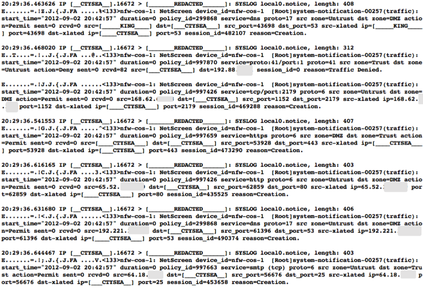

   Netscreen Event Log (Redacted)

..

.. _TippingPoint:

.. figure:: images/TippingPoint.png
   :width: 70%
   :align: center

   Tipping Point Logs (Redacted)

..

.. _WebSense:

.. figure:: images/WebSense.png
   :width: 70%
   :align: center

   WebSense Log Sample (Redacted)

..

Figure :ref:`BotnetsSyslog` illustrates what events logged by the
Botnets system detectors look like. All of these examples are for
“watchlist” detectors that simply trigger when they see a connection
to/from a host on the watchlist. Each detector has its own ID (e.g,
“CIFList” in the first entry), followed by the ranking score for that
detector (“@8” in this case for the CIFList detector). This is used in
the calculation of score for ranking significance of events in the
SIEM. Also shown are the IP addresses of the internal hosts involved
in the alerted activity, as well as the IP addresses of the systems on
the watchlists.

.. _BotnetsSyslog:

.. figure:: images/Botnets-syslog.png
   :width: 70%
   :align: center

   Botnets System Event Log (Redacted)

..

.. _HistoricEventLogs:

.. figure:: images/HistoricEventLog.png
   :width: 70%
   :align: center

   Example Historic Event Log Data (Redacted)

..

Figure :ref:`HistoricEventLogs` shows three records returned from a
search of historic event logs from the Log Matrix SEIM log
archive. These records have been anonymized to conceal the specific IP
addresses and domain names of the sources (Seattle Children’s Hospital
and the Port of Tacoma, in this case). Notice that the schema used by
this vendor includes both destination IP address and destination port,
but only includes source IP address (not source port) making certain
queries of the database impossible. For example, attempting to find
records related to malware that uses fixed source port for flooding
could not be directly queried, requiring extraction of the
“description” field (i.e., the original raw event) and parsing to
identify related records. A solution to this would be to extract all
of the data from the database and store it in a more flexible
database.

Indirectly related to the previous data sources is meta-data that
allows classification, filtering, and anonymization, based on
organizational units for networks and sites. Table
:ref:`ParticipantMapping` illustrates how top level domains and/or
CIDR blocks for a subset of PRISEM participants are mapped to their
Site ID strings and chosen anonymization strings (i.e., the label that
participant would like to use to mask their internal IP addresses and
host names in reports that are shared outside the trust group.) Their
use in identification of “Friend or Foe” is described in the Concept
of Operations document. (Such a cross-organizational correlation result using
the full map as suggested in Table :ref:`ParticipantMapping` can be seen in
Figure :ref`crosscorriff`.)

.. _ParticipantMapping:

.. list-table:: Participant identification mapping
   :widths: 20 20 20
   :header-rows: 1

   * - CIDR or Domain
     - Site ID
     - Participant

   * - 156.74.0.0/16
     - CTYSEA
     - CTYSEA

   * - .seattle.gov
     - CTYSEA
     - CTYSEA

   * - .seattle.wa.gov
     - CTYSEA
     - CTYSEA

   * - .seattle.wa.us
     - CTYSEA
     - CTYSEA

   * - 192.103.189.0/24
     - PORTTAC
     - PORTTAC

   * - 66.113.101.0/24
     - PORTTAC
     - PORTTAC

   * - .portoftacoma.com
     - PORTTAC
     - PORTTAC

   * - 174.127.160.0/24
     - COB
     - BELLWA

   * - 12.17.152.0/23
     - COB
     - BELLWA

   * - .bellevue.gov
     - COB
     - BELLWA

   * - .ci.bellevue.wa.us
     - COB
     - BELLWA

..

.. _crosscorriff:

.. figure:: images/example-crosscor-iff-friend.png
   :alt: Cross-organizational Correlation of Query Results (Redacted)
   :width: 50%
   :align: center

   Cross-organizational Correlation of Query Results (Redacted)

..

.. _NetworkFlowReport:

.. figure:: images/ExampleNetworkFlowReport.png
   :width: 70%
   :align: center

   Example Network Flow Report (Anonymized Targets)

..

.. _Mozilla Defense Platform: https://media.readthedocs.org/pdf/mozdef/latest/mozdef.pdf
.. _MozDef: https://github.com/jeffbryner/MozDef
.. _Docker: https://www.docker.com/
.. _Automating Docker Logging\: ElasticSearch, Logstash, Kibana, and Logspout: http://nathanleclaire.com/blog/2015/04/27/automating-docker-logging-elasticsearch-logstash-kibana-and-logspout/
.. _Scalable Docker Monitoring with Fluentd, Elasticsearch and Kibana 4: http://blog.snapdragon.cc/2014/11/21/scalable-docker-monitoring-fluentd-elasticsearch-kibana-4/
.. _Elasticsearch, Weave and Docker: http://weaveblog.com/2015/01/20/elasticsearch-and-weave/
.. _iantruslove/docker-elasticsearch: https://github.com/iantruslove/docker-elasticsearch
.. _Real-time monitoring of Hadoop clusters: http://blog.sequenceiq.com/blog/2014/10/07/hadoop-monitoring/
.. _Apache Hadoop 2.6.0 on Docker: http://blog.sequenceiq.com/blog/2014/12/02/hadoop-2-6-0-docker/

.. rubric:: Footnotes

.. [#metrics] http://www.semicomplete.com/presentations/logstash-hmmm
.. [#ES] http://www.elasticsearch.org/overview
