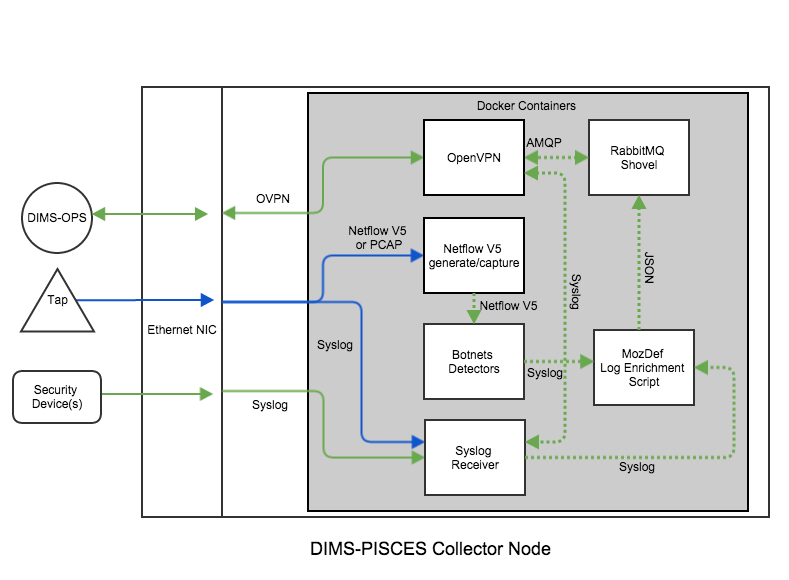
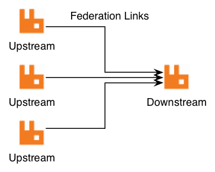
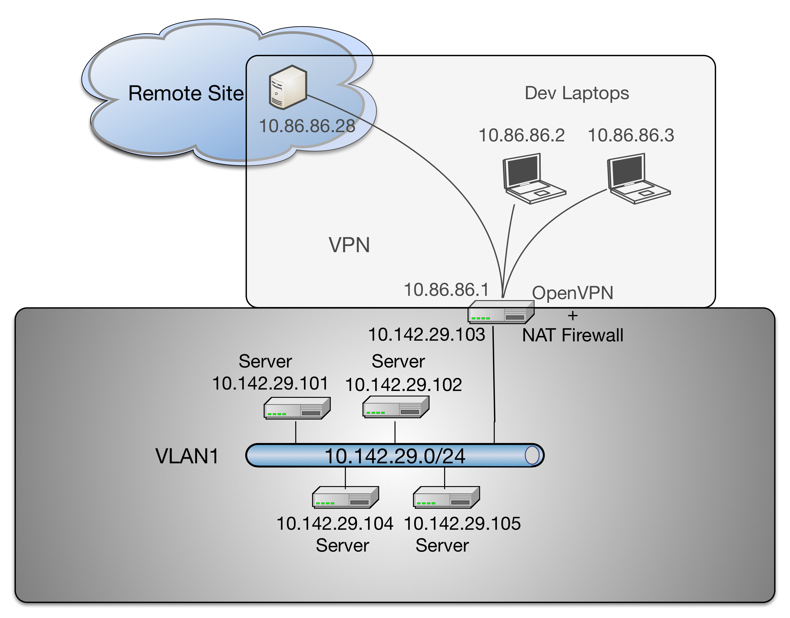

.. _dimsdetaileddesign:

DIMS detailed design
====================

.. _hardwaredetail:

Hardware Detailed Design
------------------------

.. TODO(dittrich): Fill in this section.

.. todo::

    Pull and/or reference material from the internal document
    :ref:`dimsasbuilt:dimsasbuilt`.

..

.. _prisemhardwarelayout:

.. figure:: images/hardware-layout-diagram.png
   :width: 95%
   :figwidth: 50%
   :align: right

   System Hardware Rack Layout

..

Figure :ref:`PRISEMHardwareLayoutDiagram` shows the physical hardware
configuration for PRISEM system components in the server rack located
in the UW Tower IT data center. Green boxes are those that were used
for the PRISEM Project and for DIMS system development, while white and gray boxes
are either unused or occupied by other resources. Some of the initial
physical hardware that became unstable or obsolete was replaced
was replaced by virtual machines.

The principal PRISEM hardware consisted of Dell PowerEdge servers. One
PowerEdge 1950 server (``floyd``) was used for a CIF database server, and two
Dell R720 servers (``zion`` and ``money``)
servers were used for the Log Matrix Threat Center and Log Center
servers. Both ``zion`` and ``money`` are replacements for the original Dell
R710 servers purchased at the start of the project in 2008. Virtual
machines are run on a Dell PowerEdge R715 server, with 128GB RAM,
2x12-Core 1.8GHz AMD Opteron processors, and 12 – 1TB drives in a RAID
5 array.

Physical networking is provided by multple managed switches, some
configured to support virtual LAN (VLAN) isolation. One is a D-Link xStack Managed
24-Port Gigabit L2+ 1/10-GigE switch, another a D-Link DXS-3227 1-GigE
managed switch. One VLAN provides an isolated network for
inter-system communication behind a vendor-supported stateful firewall
and OpenVPN server for remote access. Another VLAN provides
internet-routable connections in front of the firewall. At present,
only IPv4 is supported for network connectivity.

.. TODO(dittrich): Clean this section up.

.. note::

    All of this is better detailed in the internal document
    :ref:`dimsasbuilt:dimsasbuilt`.

..

.. _softwaredetail:

Software Detailed Design
------------------------

The DIMS platform is made up of several open source sub-systems.

* A Dashboard web application (written using AngularJS) for workflow
  related operations. It provides a graphical user interface for
  control, with ReST style HTTP and Unix socket interfaces
  to backend services.

* A web application server (written using Node.js) that in Javascript)
  with the following interfaces:

  * HTTP - communicates with client
  * AMQP - communicates with AMQP server
  * Socket - communicates with client
  * Redis - communicates with redis database
  * Postgres - communicates with PostgreSQL

* An OpenID authentication and LDAP directory service that is used by
  DIMS components to provide a single-signon login mechanism.

* A RabbitMQ (AMQP) message bus for supporting remote procedure
  call services, and message brokering for things like chat and
  event logging.

* A Collective Intelligence Framework database server.

All of these open source components are installed and configured
using Ansible from ad-hoc control hosts (e.g., developer laptops),
and via a Jenkins continuous integration server by manual, or
event-triggered, jobs.

.. _internalcommunication:

Internal Communications Detailed Design
---------------------------------------

Figure :ref:`MessageBus` shows the general flow of commands and logged
events from clients and services used in the PRISEM system for
inter-process communication between system components. In this
example, there are three general RPC services named *A*, *B*, and *C*.
Calls from remote clients *A* (color blue) and *B* (color black) are
processed by one of n instances of multiprocessing service daemons on
the same hardware as the AMQP broker (by multiple processes or virtual
machines). Client *C* in this diagram (color green) is also a remote
client, as is the RPC service *C*. (The AMQP broker and RPC mechanism
allows these programs to run anywhere we want.) Also depicted in this
diagram is an event feedback loop (color red). All clients and
services log significant events such as process startup, process end,
time taken to process RPC calls, or even more fine-grained debugging
output to assist developers. These events logs are published to a
fanout exchange, which distributes the events to any subscribers who
wish to consume them.

.. _MessageBus:

.. figure:: images/rabbitmq-bus-architecture.png
   :width: 70%
   :align: center

   AMQP Messaging Bus Architecture

..

Figure :ref:`PRISEMAMQP` shows a different perspective on the
central AMQP bus. Red boxes depict the command line clients,
client applications, and "service" daemons that front-end
accces to data stores (the gray boxes with solid Blue lines
on top and bottom) and other command line programs (the
Orange boxes).  The dashed Green lines are TCP connections
to the AMQP service port on the central RabbitMQ server
on the host in the bottom left of the Figure. Because each
of the Red boxes connects to the AMQP bus, it can *publish*
or *subscribe* to data flows on specified named channels
or exchanges. Programs wishing to use *services* publish
their request in the form of special JSON command object,
and they get back a special JSON response object with the
results.  (The details are described in the
:ref:`prisem:prisemdataquery` Section of the
:ref:`prisem:prisemutilities` document.

.. _PRISEMAMQP:

.. figure:: images/PRISEM-amqp-flows.png
   :width: 70%
   :align: center

   PRISEM AMQP Data Flows

..

There are several services available within the PRISEM architecture as
Remote Procedure Call (RPC) services, with some data distribution and
feedback mechanisms in the form of publish/subscribe fanout
services. These are:

* RPC service ``rwfind`` – This service provides search capability to
  stored network flow records kept in SiLK tools format. It returns the
  results in text report format for human consumption, or in structured
  JSON format for simplified processing by programs.

* RPC service ``anon`` – This service provides IP address and DNS name
  identification/anonymization/extraction, statistics, match/non-match
  identification, and other functions, using the ``ipgrep`` script. This
  service is called as part of the ``crosscor`` service in order to
  *identify friend or foe*.

* RPC service ``cifbulk`` – This service front-ends the Sphinx database
  accelerator, which provides a read-only snapshot of the CIF database
  for a 10:1 speed increase for queries. It takes as input a list of
  items to search for, and iterates over the list of items it is passed
  concatenating the results (which are JSON by design) into a JSON
  array.

* RPC service ``crosscor`` – This service performs cross-organizational
  correlation on search results obtained from the ``rwfind``, ``lmsearch``,
  and ``cifbulk`` services.

* Watchlist generation – Currently, a scheduled script produces
  watchlist files from CIF feeds and distributes them to systems that
  use the watchlists via ``rsync`` over SSH tunnels. These will be replaced,
  eventually, with publish/subscribe services via AMQP.

* Daily reports from the Botnets system – Currently, a scheduled script
  generates daily reports that summarize the detected activity by the
  Botnets system. This text report will be enriched with context
  provided by the ``cifbulk`` service, the ``crosscor`` service, and the
  *identify friend or foe* mechanism. This will be a model for a suite of
  DIMS scheduled reports.

Figure :ref:`dimsTrident` depicts the communication flows between components
within the DIMS code base, and those within the Trident (ops-trust portal
re-write) code base at a logical level. Both DIMS and Trident have architecturally
split their back end data stores from the front end user interfaces (each having
a command line interface and a web application graphical user interface.)

.. _dimsTrident:

.. figure:: images/DIMS-Trident-v1.png
   :figwidth: 50%
   :align: center

   DIMS and Trident Component Interfaces

..

DIMS components that need to communicate to the Trident backend user database
can either use the Trident RESTful interface in the same way as the Trident
CLI (known as ``tcli``, pronounced "tickly"), or they can use the PRISEM remote
data query mechanism to front-end ``tcli``. (See Figure :ref:`dimsTridentStack`.)
The former is likely the simplest and
most robust mechanism for web application GUI-to-backend data flows.

The PRISEM system userd an obsolete (past end-of-life) commercial SEIM
product that collected logs from participating sites, and forwarded them
to a central storage and processing system. This is described in
the :ref:`dimsocd:dimsoperationalconceptdescription`, Section
:ref:`dimsocd:prisemcapabilities`, and depicted in this document in
Figure :ref:`PRISEMInitialDeploymentAndFlows`.

The data flow used in the more modern *MozDef* system was described in Section
:ref:`conceptofexecution`. MozDef uses Python scripts for enrichment of
incoming event logs, optionally received via AMQP (using RabbitMQ) (see
`MozDef Concept of Operations`_).

.. _MozDef Concept of Operations: http://mozdef.readthedocs.org/en/latest/introduction.html#concept-of-operations

To replace this distributed log collection system with an open source
alternative, the features of RabbitMQ known as `Federated Queues`_ and
`Distributed RabbitMQ brokers`_ (specifically, the `Shovel plugin`_),
implemented in Docker containers like other DIMS components, can be
used. This architecture is depicted in Figure :ref:`proposedcollector`.

.. _Federated Queues: https://www.rabbitmq.com/federated-queues.html
.. _Distributed RabbitMQ brokers: https://www.rabbitmq.com/distributed.html
.. _Shovel plugin: https://www.rabbitmq.com/shovel.html
.. _proposedcollector:

   Proposed DIMS-PISCES Collector Architecture

..

The mechanisms for implementing this distributed collection archicture using
RabbitMQ are described in:

+ `Alvaro Videla - Building a Distributed Data Ingestion System with RabbitMQ`_, YouTube, Jul 16, 2014
+ `Distributed log aggregation with RabbitMQ Federation`_, by Alvaro Videla, December 17, 2013
+ `Routing Topologies for Performance and Scalability with RabbitMQ`_, by Helena Edelson, April 1, 2011

.. _Alvaro Videla - Building a Distributed Data Ingestion System with RabbitMQ: https://youtu.be/EUfSgYU_SFk
.. _Routing Topologies for Performance and Scalability with RabbitMQ: http://spring.io/blog/2011/04/01/routing-topologies-for-performance-and-scalability-with-rabbitmq/
.. _Distributed log aggregation with RabbitMQ Federation: http://jaxenter.com/distributed-log-aggregation-with-rabbitmq-federation-107287.html

As described in `Distributed log aggregation with RabbitMQ Federation`_, the relationship
between participant sites with the DIMS-PISCES collector is one of `upstream`
exchanges, which will feed the central DIMS-PISCES backend data store
acting as a `downstream` exchange via the RabbitMQ `Shovel plugin`_.

.. _upstreamdownstream:

   Relationship between Upstream and Downstream Exchanges

..

Certain types of information that are related to the site where
the upstream exchange is located make sense to be included by
the producer scripts when queueing events at the upstream for
later transport to the downstream exchange.  These would be
things like geolocation from an off-line database (e.g., Maxmind),
and tagging with the SiteID, etc.

.. todo::

    Describe how the event logs at an upstream participant site are collected,
    processed, and forwarded to the central backend data store.  These steps
    are:

    #. Parsing from Unix ``syslog`` format to JSON.

    #. Enrichment with site-specific information:

        #. Adding participant *SiteID*.

        #. Mapping of RFC 1918 addresses to routable (i.e., post-NAT)
           address(es).

        #. TLP tagging(?).

    #. Publishing to AMQP upstream exchange for local queueing
       and forwarding to downstream exchange for insertion into
       backend data store.

    .. note::

       Logs for the DIMS-PISCES system processes and security systems should
       themselves be enriched with *SiteID* and identified as being DIMS-PISCES
       related to separate them from other security event logs.  This allows
       for monitoring of the health of the DIMS-PISCES system itself.  These
       events are otherwise processed identically to security events to
       simplify the design of the system.

    ..

..

.. todo::

    .. attention::

        Tuning of RabbitMQ queues should take into account the number of events
        received per collector per day, times the number of days of network
        outage that would be tolerable, in order to avoid losing events. If we
        can determine these numbers from the existing PRISEM system, or derive
        it from historical log data, that would help with tuning.

    ..

..

Other types of data *do not make sense* to add at the upstream, most notably
data that resides at the central backend data store (e.g, data held in the
Collective Intelligence Framework (CIF) database, which was described in
Section :ref:`dimsocd:currentsystem` of the
:ref:`dimsocd:dimsoperationalconceptdescription`.) In order a producer to tag
data using information stored remotely, the producer would have to make a
remote query for the data, then insert it, then queue the event log data.  This
requires that this added data transit the network twice (once in response to
the query for it, and again when the event log is transmitted from upstream
exchange to downstream exchange.)

It makes more sense to insert a consumer on the downstream exchange that does
this enrichment using locally available data, then index it in the backend data
store.

.. todo::

    Describe how the event logs are enriched at the downstream collection
    point before being indexed in the backend data store.

    These steps for enrichment at the downstream collector would include:

    #. Enrichment of security event data with data available in the Collective
       Intelligence Framework (CIF) database.

    #. Enrichment of DIMS-PISCES system monitoring data with system-specific
       attributes (e.g., TTL or expiration date).

..

Other web pages that provide alternative methods of collecting log
events in Docker containers include the following:

    + `Automating Docker Logging: ElasticSearch, Logstash, Kibana, and Logspout`_, by Nathan LeClaire, Apr 27, 2015
    + `Scalable Docker Monitoring with Fluentd, Elasticsearch and Kibana 4`_, by manu, November 21, 2014
    + `syslog logging driver for Docker`_, by Mark Wolfe, May 3, 2015
    + `Real-time monitoring of Hadoop clusters`_, by Attila Kanto, October 7, 2014

.. _externalcommunication:

External Communications Detailed Design
---------------------------------------

Figure :ref:`dimsvpnvlan1` shows a conceptual view of remote access
to an internal Virtual LAN (VLAN) via an OpenVPN tunnel. Each of
the hosts at the top of the diagram (a remote system, such as a
data collector node, in the upper left, and two developer
laptops at the upper right.)

.. _dimsvpnvlan1:

   Conceptual Diagram of Remote VPN Access

..

Remote OpenVPN clients connect to the OpenVPN server and a tunnel
interface (``tun0``) is created for each host on the subnet
``10.86.86.0/24``. The OpenVPN server provides Network Address
Translation (NAT) services to these devices to its internal
interface on the internal virtual LAN (``VLAN1``) using
the ``10.142.29.0/24`` network block. Bare-metal and virtual
machine servers sharing this VLAN are thus directly accessible
behind the firewall.

.. note::

    Not depicted in Figure :ref:`dimsvpnvlan1` are the specific routable
    IP addresses that each of the tunnel clients on the top of the
    diagram, nor the OpenVPn server itself, are using. The OpenVPN
    server is shown as splitting the two boxed virtual networks to indicate its
    role in providing remote access that connects the two virtual networks by
    way of a tunnel using the network address range ``10.86.86.0/24`` in this
    case.  To include the Internet-routable IP addresses, while being more
    precise, complicates the diagram.  These laptops have two interfaces (one
    wired, one wireless) that can be used for Internet access required to
    connect to the OpenVPN server via a public IP address.

..

.. _Automating Docker Logging\: ElasticSearch, Logstash, Kibana, and Logspout: http://nathanleclaire.com/blog/2015/04/27/automating-docker-logging-elasticsearch-logstash-kibana-and-logspout/
.. _Scalable Docker Monitoring with Fluentd, Elasticsearch and Kibana 4: http://blog.snapdragon.cc/2014/11/21/scalable-docker-monitoring-fluentd-elasticsearch-kibana-4/
.. _syslog logging driver for Docker: http://www.wolfe.id.au/2015/05/03/syslog-logging-driver-for-docker/
.. _Real-time monitoring of Hadoop clusters: http://blog.sequenceiq.com/blog/2014/10/07/hadoop-monitoring/

