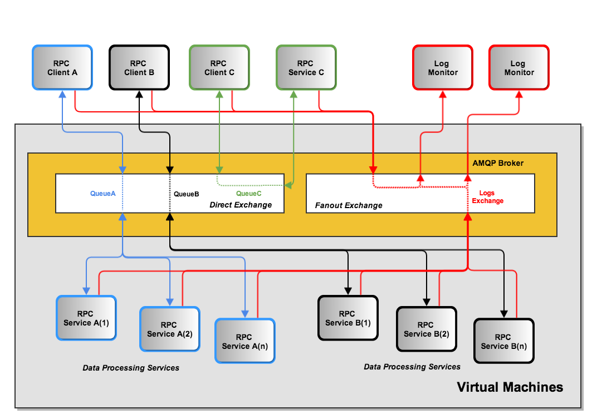

.. _dimsdetaileddesign:

DIMS detailed design
====================

.. _hardwaredetail:

Hardware Detailed Design
------------------------

.. TODO(dittrich): Fill in this section.

.. todo::

    Pull and/or reference material from the internal document
    :ref:`dimsasbuilt:dimsasbuilt`.

..

.. _PRISEMHardwareLayoutDiagram:

PRISEM Hardware Layout Diagram
~~~~~~~~~~~~~~~~~~~~~~~~~~~~~~

.. _prisemhardwarelayout:

.. figure:: images/hardware-layout-diagram.png
   :width: 95%
   :figwidth: 50%
   :align: right

   System Hardware Rack Layout

..

Figure :ref:`PRISEMHardwareLayoutDiagram` shows the physical hardware
configuration for PRISEM system components in the server rack located
in the UW Tower IT data center. Green boxes are those that were used
for the PRISEM Project and for DIMS system development, while white and gray boxes
are either unused or occupied by other resources. Some of the initial
physical hardware that became unstable or obsolete was replaced
was replaced by virtual machines.

The principal PRISEM hardware consisted of Dell PowerEdge servers. One
PowerEdge 1950 server (``floyd``) was used for a CIF database server, and two
Dell R720 servers (``zion`` and ``money``)
servers were used for the Log Matrix Threat Center and Log Center
servers. Both ``zion`` and ``money`` are replacements for the original Dell
R710 servers purchased at the start of the project in 2008. Virtual
machines are run on a Dell PowerEdge R715 server, with 128GB RAM,
2x12-Core 1.8GHz AMD Opteron processors, and 12 – 1TB drives in a RAID
5 array.

Physical networking is provided by multple managed switches, some
configured to support virtual LAN (VLAN) isolation. One is a D-Link xStack Managed
24-Port Gigabit L2+ 1/10-GigE switch, another a D-Link DXS-3227 1-GigE
managed switch. One VLAN provides an isolated network for
inter-system communication behind a vendor-supported stateful firewall
and OpenVPN server for remote access. Another VLAN provides
internet-routable connections in front of the firewall. At present,
only IPv4 is supported for network connectivity.

.. TODO(dittrich): Clean this section up.

.. note::

    All of this is better detailed in the internal document
    :ref:`dimsasbuilt:dimsasbuilt`.

..

.. _softwaredetail:

Software Detailed Design
------------------------

The DIMS platform is made up of several open source sub-systems.

* A Dashboard web application (written using AngularJS) for workflow
  related operations. It provides a graphical user interface for
  control, with ReST style HTTP and Unix socket interfaces
  to backend services.

* A web application server (written using Node.js) that in Javascript)
  with the following interfaces:

  * HTTP - communicates with client
  * AMQP - communicates with AMQP server
  * Socket - communicates with client
  * Redis - communicates with redis database
  * Postgres - communicates with PostgreSQL

* An OpenID authentication and LDAP directory service that is used by
  DIMS components to provide a single-signon login mechanism.

* A RabbitMQ (AMQP) message bus for supporting remote procedure
  call services, and message brokering for things like chat and
  event logging.

All of these open source components are installed and configured
using Ansible from ad-hoc control hosts (e.g., developer laptops),
and via a Jenkins continuous integration server by manual, or
event-triggered, jobs.

.. _internalcommunication:

Internal Communications Detailed Design
---------------------------------------

Figure :ref:`MessageBus` shows the general flow of commands and logged
events from clients and services used in the PRISEM system for
inter-process communication between system components. In this
example, there are three general RPC services named *A*, *B*, and *C*.
Calls from remote clients *A* (color blue) and *B* (color black) are
processed by one of n instances of multiprocessing service daemons on
the same hardware as the AMQP broker (by multiple processes or virtual
machines). Client *C* in this diagram (color green) is also a remote
client, as is the RPC service *C*. (The AMQP broker and RPC mechanism
allows these programs to run anywhere we want.) Also depicted in this
diagram is an event feedback loop (color red). All clients and
services log significant events such as process startup, process end,
time taken to process RPC calls, or even more fine-grained debugging
output to assist developers. These events logs are published to a
fanout exchange, which distributes the events to any subscribers who
wish to consume them.

.. _MessageBus:

   AMQP Messaging Bus Architecture

..

Figure :ref:`PRISEMAMQP` shows a different perspective on the
central AMQP bus. Red boxes depict the command line clients,
client applications, and "service" daemons that front-end
accces to data stores (the gray boxes with solid Blue lines
on top and bottom) and other command line programs (the
Orange boxes).  The dashed Green lines are TCP connections
to the AMQP service port on the central RabbitMQ server
on the host in the bottom left of the Figure. Because each
of the Red boxes connects to the AMQP bus, it can *publish*
or *subscribe* to data flows on specified named channels
or exchanges. Programs wishing to use *services* publish
their request in the form of special JSON command object,
and they get back a special JSON response object with the
results.  (The details are described in the
:ref:`prisem:prisemdataquery` Section of the
:ref:`prisem:prisemutilities` document.

.. _PRISEMAMQP:

   PRISEM AMQP Data Flows

..

There are several services available within the PRISEM architecture as
Remote Procedure Call (RPC) services, with some data distribution and
feedback mechanisms in the form of publish/subscribe fanout
services. These are:

* RPC service ``rwfind`` – This service provides search capability to
  stored network flow records kept in SiLK tools format. It returns the
  results in text report format for human consumption, or in structured
  JSON format for simplified processing by programs.

* RPC service ``anon`` – This service provides IP address and DNS name
  identification/anonymization/extraction, statistics, match/non-match
  identification, and other functions, using the ``ipgrep`` script. This
  service is called as part of the ``crosscor`` service in order to
  *identify friend or foe*.

* RPC service ``cifbulk`` – This service front-ends the Sphinx database
  accelerator, which provides a read-only snapshot of the CIF database
  for a 10:1 speed increase for queries. It takes as input a list of
  items to search for, and iterates over the list of items it is passed
  concatenating the results (which are JSON by design) into a JSON
  array.

* RPC service ``crosscor`` – This service performs cross-organizational
  correlation on search results obtained from the ``rwfind``, ``lmsearch``,
  and ``cifbulk`` services.

* Watchlist generation – Currently, a scheduled script produces
  watchlist files from CIF feeds and distributes them to systems that
  use the watchlists via ``rsync`` over SSH tunnels. These will be replaced,
  eventually, with publish/subscribe services via AMQP.

* Daily reports from the Botnets system – Currently, a scheduled script
  generates daily reports that summarize the detected activity by the
  Botnets system. This text report will be enriched with context
  provided by the ``cifbulk`` service, the ``crosscor`` service, and the
  *identify friend or foe* mechanism. This will be a model for a suite of
  DIMS scheduled reports.

Figure :ref:`dimsTrident` depicts the communication flows between components
within the DIMS code base, and those within the Trident (ops-trust portal
re-write) code base at a logical level. Both DIMS and Trident have architecturally
split their back end data stores from the front end user interfaces (each having
a command line interface and a web application graphical user interface.)

.. _dimsTrident:

.. figure:: images/DIMS-Trident-v1.png
   :figwidth: 50%
   :align: center

   DIMS and Trident Component Interfaces

..

DIMS components that need to communicate to the Trident backend user database
can either use the Trident RESTful interface in the same way as the Trident
CLI (known as ``tcli``, pronounced "tickly"), or they can use the PRISEM remote
data query mechanism to front-end ``tcli``. (See Figure :ref:`dimsTridentStack`.)
The former is likely the simplest and
most robust mechanism for web application GUI-to-backend data flows.

.. TODO(dittrich): Commenting out all of the scaffolding for now to clean up the rendered doc

.. (Project-unique identifier of a software unit, or designator of a group of software units)
.. ------------------------------------------------------------------------------------------
..
.. .. todo::
..
..    This paragraph shall identify a software unit by project-unique identifier and
..    shall describe the unit. The description shall include the following
..    information, as applicable. Alternatively, this paragraph may designate a group
..    of software units and identify and describe the software units in
..    subparagraphs. Software units that contain other software units may reference
..    the descriptions of those units rather than repeating information.
..
..        * Unit design decisions, if any, such as algorithms to be used, if not previously selected
..
..        * Any constraints, limitations, or unusual features in the design of the software unit
..
..        * The programming language to be used and rationale for its use if other than the specified CSCI language
..
..        * If the software unit consists of or contains procedural commands (such as
.. 	 menu selections in a database management system (DBMS) for defining forms
.. 	 and reports, on-line DBMS queries for database access and manipulation,
.. 	 input to a graphical user interface (GUI) builder for automated code
.. 	 generation, commands to the operating system, or shell scripts), a list
.. 	 of the procedural commands and reference to user manuals or other
.. 	 documents that explain them.
..
..        * If the software unit contains, receives, or outputs data, a description
.. 	 of its inputs, outputs, and other data elements and data element
.. 	 assemblies, as applicable. Paragraph 4.3.x of this DID provides a list of
.. 	 topics to be covered, as applicable. Data local to the software unit
.. 	 shall be described separately from data input to or output from the
.. 	 software unit. If the software unit is a database, a corresponding
.. 	 Database Design Description (DBDD) shall be referenced; interface
.. 	 characteristics may be provided here or by referencing section 4 or the
.. 	 corresponding Interface Design Description(s).
..
..        * If the software unit contains logic, the logic to be used by the software unit, including, as applicable:
..
..
.. 	   * Conditions in effect within the software unit when its execution is initiated
..
.. 	   * Conditions under which control is passed to other software units
..
.. 	   * Response and response time to each input, including data conversion, renaming, and data transfer operations
..
.. 	   * Sequence of operations and dynamically controlled sequencing during the software unit's operation, including:
..
.. 	       * The method for sequence control
..
.. 	       * The logic and input conditions of that method, such as timing variations, priority assignments
..
.. 	       * Data transfer in and out of memory
..
.. 	       * The sensing of discrete input signals, and timing relationships between interrupt operations within the software unit
..
..
..        * Exception and error handling
..
..
