.. _systemwidedecisions:

System-wide design decisions
============================

.. _background:

Background on Existing Core Components
--------------------------------------

To understand what the DIMS system is intended to provide, it is important to
understand its role in the context of distributed and collaborative incident
response. DIMS leverages the capabilities of several existing systems each
provide key functions necessary for incident response, but are not presently
designed to work together. Integrating these capabilities will result in an
increase in the capacity to respond.

.. Building DIMS from open source components will keep the cost of
.. acquisition and operation to a reasonable level that is
.. sustainable by SLTT government entities who are cash-strapped,
.. resource-limited, yet critical to providing services to the
.. general public who are their consituents.

Figure :ref:`dimsSystemOverview` depicts a high-level diagram of the dataflows
between DIMS and related system.

.. _dimsSystemOverview:

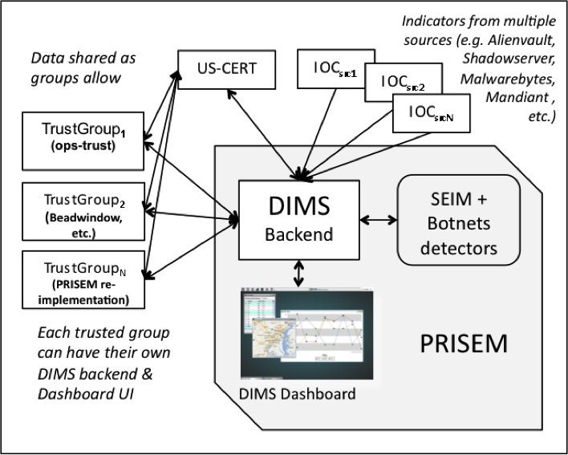

   Overview of DIMS System

..

DIMS provides a user interface layer on the front end, as well as a data
processing layer on the back end, that integrates with several existing
systems.

+ The first is the Security Information Event Management (SIEM) system at the
  core of the PRISEM project, and the technologies associated with it to
  perform behavioral detection of malicious activity from network flow data and
  support forensic analysis of historic data to respond and recover from
  attacks that evade detective mechanisms. This system collects and processes
  tens of millions of security related events (and network flow records, if
  desired) and supports a collective approach to responding and recovering from
  security events.

+ The second system is the Ops-Trust portal system, used by a community of
  several hundred computer security professionals with operational and research
  roles in industry, government, and academia. This system is primarily
  designed to facilitate trust group maintenance and communication to deal with
  emerging threats and events of international scope. (It is now in its
  second incarnation, as the *Trident* system).

+ The third are the suite of "big data" style open source unstructured data
  storage, log processing, log visualization, and other tools that are part of
  the ELK stack, MozDef, and CIF.

+ Additional tools that can be used for visualization can be similarly
  integrated (such as Mal4s), by building them into the system deployment
  infrastructure like any other components used in DIMS. This type of
  `framework` model, if generalized, allows any of a number of open source
  security tools to be made available to the incident responder.

The DIMS software system will bring these systems together into a collaborative
environment for shared analysis and shared response of shared threats, both
within a regional trust community, as well as across multiple such trust
communities in other regions.  Through vertical sharing of indicators of
compromise from US-CERT to the regional level, and lateral sharing across
regional entities, the objective is to scale actionable information sharing to
state, local, territorial, and tribal (SLTT) government entities across the
United States, and extend the sharing to international trust groups who make up
the global fabric of the internet.

.. _DataFlowsBetweenStakeholders:

.. figure:: images/stix-dataflows-v1.png
   :width: 70%
   :align: center

   Data Flows Between Stakeholders

..

Figure :ref:`DataFlowsBetweenStakeholders` depicts the data flows
between a subset of the stakeholders who will be using the DIMS
software system. The solid lines depict data that has the highest
degree of sensitivity and trust, often being transmitted in
un-redacted form (possibly tagged with TLP indicators for most
restricted sharing). The dashed lines depict data flows that are at
lower levels of trust, and may be transmitted only in redacted form
(possibly tagged with TLP indicators for the least restricted
sharing). The type of data shared may be structured IOC and
Observables in STIX format, Course of Action information in either PDF
or structured format, `Situational Awareness Report` (:term:`SITREP`)
documents that describe observed campaign level activity at a high
level, possibly with structure data containing IOCs or Observables to
assist recipients in searching for related activity, and incident
reports that may similarly be a combination of human-readable PDF and
machine-readable IOCs/Observables. There are two types of data that
will be shared in most use cases: high-frequency, high-volume,
automated data feeds of `reputation` data and IOCs/Observables coming
from analytic and research groups; low-frequency, low-volume, manually
triggered bundles of IOCs/Observables, Course of Action information,
and/or high-level SITREPs for specific
incident-level up to campaign-level activity.

.. _dimsTridentStack:

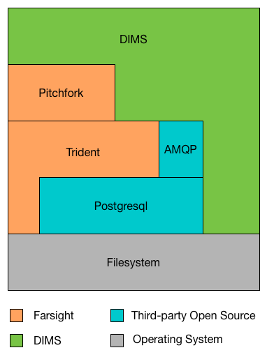

   DIMS and Trident Component Stack

..

The DIMS software,
layered on top of the Ops-Trust portal system as illustrated in
Figure :ref:`dimsTridentStack`, will facilitate
production of these reports and transmission/reception of structure
data files and facilitate automated processing of the structure data
files to pre-process data for an analyst to consume when ready, rather
than forcing the analyst to do a lot of work manipulating files,
processing their contents, and manually entering data into report
generation front ends in web based portals. (See also Figure
:ref:`dimsTrident`.)

Figure :ref:`PRISEMInitialDeploymentAndFlows` depicts the high-level
data flow relationships for the Security Information Event Management
(SIEM) system and Botnets detector subsystem used in the PRISEM
project as it was initially deployed in 2009. The City of Seattle (the
first and to this date largest participant organization) has multiple
security devices sending event logs into the system.  It also
generates NetFlow V5 records that are processed by real-time
detectors, and archived for historical query capability. The logs are
collected one site, then forwarded to the central SIEM for processing
at the University of Washington.

.. _PRISEMInitialDeploymentAndFlows:

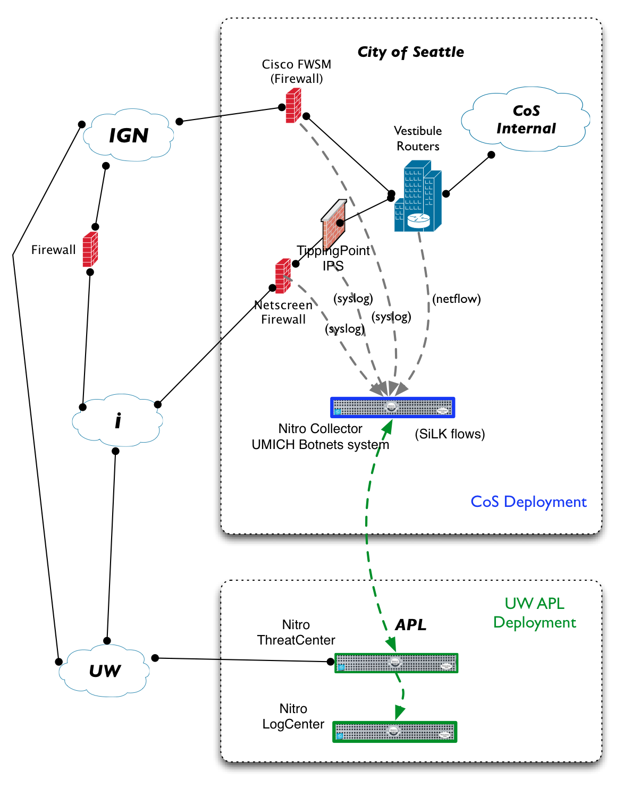

   PRISEM Initial Deployment and Flows

..

Figure :ref:`Netflow-Architecture` depicts a prototypical NetFlow
collection and archiving model. The PRISEM system uses a slightly
modified version of this model. Unlike the diagram in Figure 4, the
PRISEM system processes NetFlow records as they enter the `NetFlow
Collector` in the center of the diagram, sending copies to the Botnets
system detectors. One of the processes receiving these records
performs the storage task, however it converts the NetFlow V5 records
to SiLK format before storing them. The SiLK tool suite is then used
to process these historic logs (e.g., performing historic queries).

.. _Netflow-Architecture:

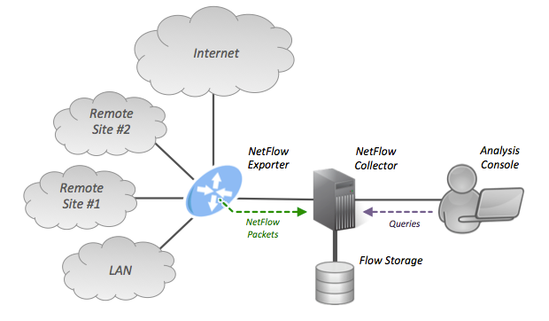

   Netflow Architecture

..

Figure :ref:`Botnets-Architecture` shows the high-level architecture
of the Botnets network flow-based behavioral detector system. One or
more NetFlow V5 feeds are combined into a single feed, which
duplicates each NetFlow record and fans them out in to N different
detectors. Each detector maintains its own state and sends out alerts
when appropriate via SNMP, standard output to users in realtime, or to
the Unix syslog service. (In Figure 5, syslog events are sent to a
remote syslog server and processed by ZenOSS, an open source IT
monitoring system. In the PRISEM system, all detectors alert via
syslog, which are processed by the Log Matrix Threat Center
application.)

.. _Botnets-Architecture:

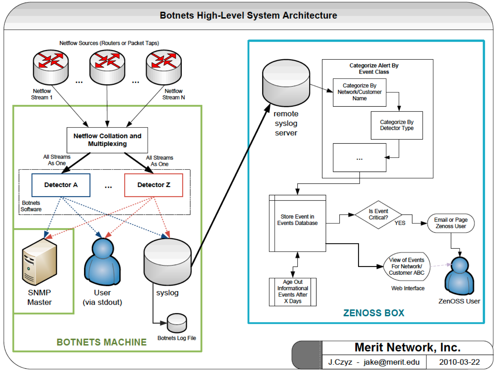

   Botnets System High-Level Architecture

..

Figure :ref:`PRISEM-Architecture` shows the central system
architecture of the PRISEM system. Shown in green are the Security
Information Event Management (SIEM) system and event log archive in
the bottom right. The box in the upper right depicts an instance of
the network flow monitoring (“Botnets” detector system) and SiLK data
archiving, which is typically housed on-site at participant networks
due to sensitivity of network flow data. A central instance of the
Collective Intelligence Framework (CIF) v0.1 database provides
historic information about known malicious activity, which is used to
pull watchlists that the Botnets detectors use for behavioral
detection. A virtual machine server provides processing and AMQP
broker functions to integrate data from multiple sources and correlate
it across participating organizations, and optionally anonymize or
filter any data prior to sharing. At present, a vendor-proprietary
portal provides the graphical user interface front-end for
participants, with the primary PRISEM systems residing behind a
vendor-supported firewall, with command line utilities and AMQP access
provided via an OpenVPN server for secure access. The DIMS dashboard
will front-end this portal and support additional capabilities that
are available on the PRISEM back-end via the AMQP broker.

.. TODO(dittrich): Figure out what "Figure TODO-26 and TODO-27" means.
.. todo::

    Figure out that this refered to: "(See Figure
    TODO-26 and Figure TODO-27)."

..

.. _PRISEM-Architecture:

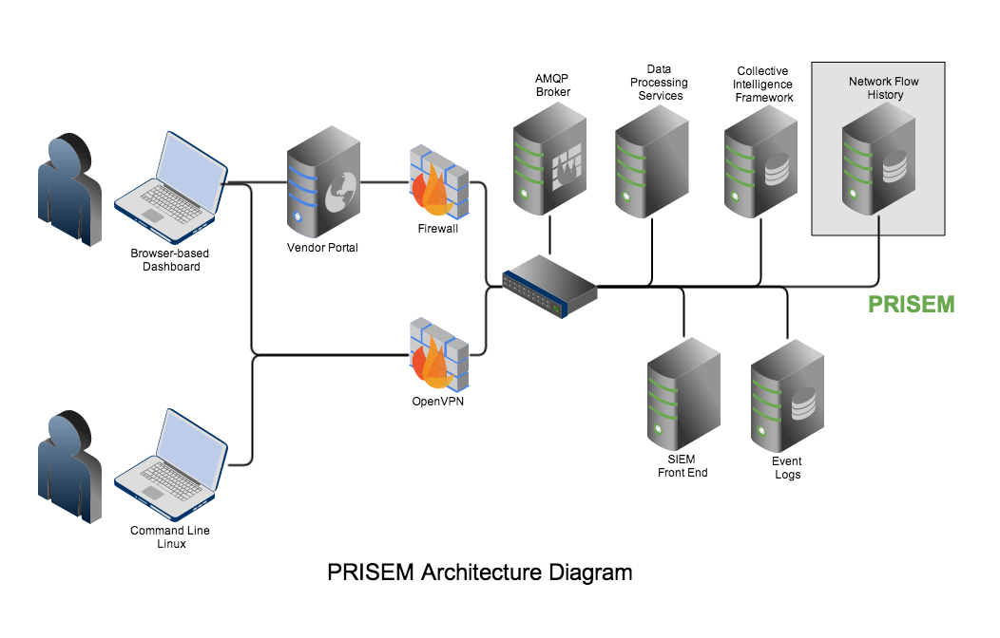

   PRISEM Architecture

..

Figure :ref:`OpsTrustArchitectureDiagram` shows the basic architecture
of the Ops-Trust portal system. This system is a combination of a
web-based portal, a wiki for information archiving, an email server,
and DNS and LDAP services tied to OpenID authentication services to
provide single-signon capability. All of these services are provided
via four separate virtual machines, co-resident in a single 1U server
that is backed up off-site. The instance depicted in
:ref:`OpsTrustArchitectureDiagram` is hosted on Ops-Trust hardware. A
development instance will be set up at the UW for DIMS development,
and potentially multiple local test instances will be set up for
PRISEM users (and possibly also Agora members, currently running in
the multiple hundreds of individuals) to beta-test DIMS features.

.. _OpsTrustArchitectureDiagram:

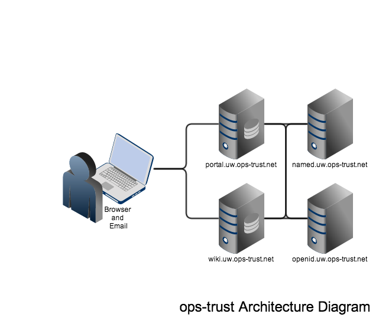

   Ops-Trust Architecture Diagram

..

The Ops-Trust portal stores attributes about each member. Figure :ref:`OpsTrustMemberPage` shows the
account for the PI, which includes: user UUID; home time zone; nearest
airport (to facilitate contact and meet-ups when one is on travel);
how to contact via email, postal mail, SMS, IM, and phone; and current
PGP encryption key. The portal lets you sign up for email lists, and
switch between "trust groups". After signing up for (and
optionally being approved for membership) email lists, the user is
included on list email routed through the mail server, and granted
access to the appropriate section of the wiki.

.. _OpsTrustMemberPage:

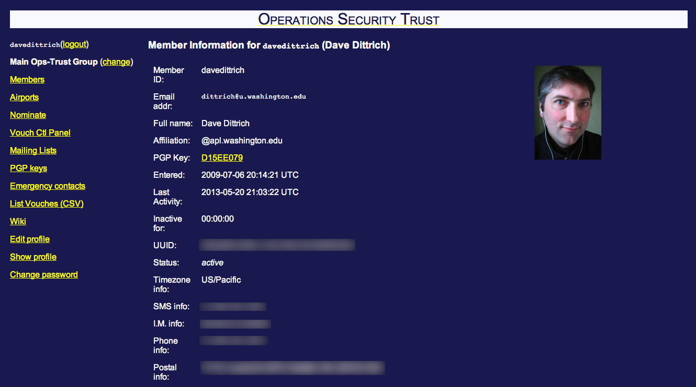

   Ops-Trust Member Information Page

..

The DIMS system will take advantage of the foundation of services
provide by this portal in several ways. It will use it as a means of
storing more information about users, the network assets they protect,
the policies and mechanisms for anonymizing and filtering data based
on TLP tagging, etc. It will also use it as a mechanism to distribute
data to users as needed (e.g., alerts about email threads that pertain
to the network assets they protect, providing a means to download
OpenVPN certificates and SSH keys, as a mechanism for storing and
organizing data associated with incidents and campaigns they are
dealing with, etc.) The ability to manage encrypted communications and
multiple email lists facilitates trusted communication and offers a
basis for sending structured threat information in encrypted form,
directly from one user to another, or from a user to all members of a
list.

.. _swdevmethodology:

Software Development Methodology
--------------------------------

As the DIMS system relies upon and integrates multiple existing open source
software components, and code developed by the DIMS developers, the system is
being developed using an Agile programming development methodology (as opposed
to the classic `waterfall` development methodology with its sequential
processes.) This document, therefore, is a `living document` that will be
updated as the project proceeds and as cyclic input/feedback from users and
testers is received. Sections to be addressed in future releases of this
document are listed as TBA.

The DIMS project involves coordination of team members in multiple
locations, multiple time zones, and multiple overlapping areas of
responsibility. In order to communicate, coordinate, maintain momentum of
project development, and meet deliverable requirements of the contract
with the sponsor, all DIMS team members must be able to work asynchronously,
independently, and be responsible for following task prioritization or
asking for direction as necessary.

.. _agile:

Use of Agile Development Methodology
~~~~~~~~~~~~~~~~~~~~~~~~~~~~~~~~~~~~

Integration of existing open source tools requires research into
how the existing tool is designed and how it functions, understanding
how it processes inputs and outputs, and how it is configured.

The `Agile methodology`_ and `Scrum methodology`_ involve making small
incremental changes based on simple user stories (short descriptions
of what a user wants or needs), and making these changes on a short
time frame (within a `sprint`, which is usually on the order of one
or two weeks.  (See :ref:`dimssr:agiledevelopment`.)

Tasks are prioritized using the `Jira Agile`_ ticketing system, with the
objective of completion of tasking within a 2-week sprint cycle.
Weekly meetings are used to manage sprints.

Both source code, and system configuration files and installation instructions,
are maintained using the `Git`_ source code control system using `git-flow`_
and `hub`_, for eventual open source release on `GitHub`_. This supports use of
the `Vincent Dreisen branching workflow`_ to allow independent and isolated
changes to be made, which are then to be tested prior to integration into more
mainstream ``develop`` or ``master`` branches for release.

.. _continuousintegration:

Use of Continuous Integration
~~~~~~~~~~~~~~~~~~~~~~~~~~~~~

The concepts of `Continuous Integration`_ and `DevOps`_ (also known as
*agile system administration* or *agile operations*) for rapid development,
testing, and release of a functional system are employed in order to
build the overall system one component at a time, in a manner that
can support the requirements specified in :ref:`dimssr:adaptationreqs`
and :ref:`dimssr:continuousintegration`. By automating the way
systems are configured, and how DIMS developed software is installed
on them, not only are incremental changes possible with little effort,
but multiple instances can be supported. Code that reaches the
``master`` branch is considered stable and release ready, at which
point it can be pushed to test/evaluation and/or production systems.
Development test systems would be fed by less stable branches
(e.g., the ``develop`` branch.)

Documentation follows the same continuous integration and agile
methodologies, using the `Sphinx`_ program, which processes
`ReStructured Text (reST)`_ files (and is supported by the online
documentation repository, `ReadTheDocs`_.)

.. _distributedconfigmanagement:

Use of Distributed Configuration Management
~~~~~~~~~~~~~~~~~~~~~~~~~~~~~~~~~~~~~~~~~~~

At the initiation of the DIMS project, the program Ansible was
chosen for distributed system configuration and DIMS service
deployment. Use of Ansible in DIMS is described in Section
:ref:`ansibleplaybooks:ansibleintro` of
:ref:`ansibleplaybooks:ansibleplaybooks`.

.. NOTE: This same image is used in $GIT/ansible-playbooks. Change it
..       here, change it there (and vice-versa)

.. _configurationtaxonomy:

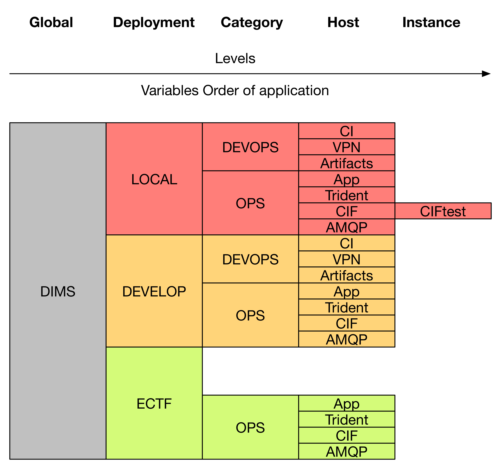

   Configuration Description Taxonomy

..

Figure :ref:`configurationtaxonomy` illustrates the taxonomy of inheritence
levels, following a left-to-right order of application of variables using
global, ``group_vars`` and ``host_vars`` files (potentially augmented by
playbook-level ``vars`` files for specific services.)

.. attention::

    Setting variables in Ansible is quite complicated and should be studied and
    understood well by anyone attempting to construct playbooks or configure
    hosts and services. The ability to gain insight into how variables are set
    at runtime is crucial. The :ref:`ansibleplaybooks:ansibleplaybooks`
    documentation covers this topic.

..

.. _containerization:

Use of Containerization
~~~~~~~~~~~~~~~~~~~~~~~

During the Base year of the DIMS project, the focus was on taking
as many open source tools as possible, and code developed by
the DIMS team, and installing it on virtual machines using:

+ Ubuntu (versions 10.04, 12.04, and 14.04), CentOS 5 and 6,
  and Mac OS X as host operating systems;

+ Virtualbox and KVM as hypervisors;

+ Packer for turning operating system installation ISOs
  into Box files for Virtualbox;

+ Vagrant for provisioning virtual machines on developers'
  host operating systems of choice;

+ Ansible for compiling code, configuring operating systems
  and services, installing pre-requisites libraries and
  tool dependencies, and other required DIMS tasks.

The team ran into a series of endlessly repeating problems
that made progress painstakingly slow. These included:

+ One person could get something running, only to hand it
  over to someone else to test (who could not run it).

+ One team member could compile and install a program
  (because they had set up their system before hand with
  the requisite sofware), but another ran into missing
  dependencies and was blocked, not knowing what to do
  to get past the block.

+ One team member could check in source code, only to
  find that another team member could not check it out
  because they had an out-of-date Git client.

+ One team member could build a virtual machine with
  an open source package on it, but another did not know
  how to replicate the steps in the right order and could
  not get it to run.

+ One team member would research a task, complete coding
  of Ansible playbooks to install the given software,
  but nobody else on the team could test it because they
  did not know the code existed or how to invoke it.

+ One team member would code solutions to a problem that
  prevented widespread deployment of a given capability
  (such as component tests, status information collection,
  or event logging), but others on the team were not
  aware of the need to update their own development
  environments and things that formerly worked for them
  would "break".

+ Frequently, only one team member was expert in a particular
  software package or operating system, but nobody else was.
  This made the person who knew how to do something a blocker
  in the critical path. If they were not available when someone
  else was trying to meet a deadline, the block would halt
  progress.

+ Even when things worked right, and complete Vagrant virtual machines
  could be built and run with specific services running within them,
  IP addresses had to be configured by hand, and no DNS service
  existed that knew how to serve those IP addresses from domain names.
  This made it difficult for the team to know how to link services
  together, so things only worked when all software was installed
  in a single virtual machine (assuming that conflicting dependencies
  for libraries and operating system did not prevent all the software
  components from running on the same virtual machine.)

The result was what seemed like an endless chain of blockers that
introduced friction throughout the entire process.

:ref:`dimsocd:newsystem` describes the operational concept for a
new system, the DIMS framework model, which requires a mechanism
that avoids the problems described above. The best available
solution to these problems appears to be the use of
`containers` (also known as `Operating-system-level virtualization`_,
or `Microservices`_ architecture).

`Docker`_ is seen as the leading technology in this area, garning a tremendous amount of
support and energy. Docker is, "an open source project designed to easily
create lightweight, portable, self-sufficient containers from any application."
Their motto is "Build, ship, and run any application, anywhere."
One of the main benefits of the use of containers is getting
away from "dependency hell" of trying to fit a `least-common-denominator`
of:

+ *operating system* +
+ *OS version* +
+ *specific libraries* +
+ *specific programming languages* +
+ *specific dependant programs* +
+ *specific service configuration settings*

Docker containers are not the perfect solution, by any means. There are
certain security concerns, issues with linking containers together,
keeping them up and running in the face of uncaught exceptions,
etc. (Many of these same problems exist with use of bare-metal or
virtual machines, so certain challenges remain regardless.)
Figure :ref:`dockerservices` (from https://coreos.com/using-coreos/)
illustrates a 3-tiered web application in a clustered containter
deployment.

.. _dockerservices:

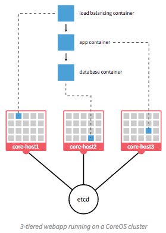

   Run Services with Docker

..

The suite of tools for orchestration, shared container components
used to build higher-level images, distributed configuration and
service discovery, persistent storage across clustered systems,
domain name services, logging, and monitoring across a vast number
of systems, all put Docker in a strong position in terms of open
source software as opposed to virtual machines and the
equivalent tools to manage large numbers of virtual machines.
(The commercial tools supporting these tasks on virtual machines
are out of the price range of SLTT government entities, let
alone small- and medium-sized businesses and volunteer
incident response groups.)

.. note::

   For more information on all of these topics, see the
   `Containerization, Virtualization, "Microservice Architectures"`_ section
   of the PI's home page and the document
   :ref:`dimsdockerfiles:usingdockerindims`.

..

.. _Containerization, Virtualization, "Microservice Architectures": https://staff.washington.edu/dittrich/home/unix.html#containerization-virtualization-microservice-architectures
.. _Docker: https://www.docker.com/
.. _Operating-system-level virtualization: http://en.wikipedia.org/wiki/Operating-system-level_virtualization
.. _Microservices: https://en.wikipedia.org/wiki/Microservices
.. _MozDef: http://mozdef.readthedocs.org/en/latest/
.. _Agile methodology: http://agilemethodology.org
.. _Scrum methodology: http://scrummethodology.com
.. _Jira Agile: https://www.atlassian.com/software/jira/agile
.. _Git: http://git-scm.com
.. _GitHub: https://github.com
.. _hub: https://hub.github.com/
.. _git-flow: http://danielkummer.github.io/git-flow-cheatsheet/
.. _Vincent Dreisen branching workflow: http://nvie.com/posts/a-successful-git-branching-model/
.. _Sphinx: http://sphinx-doc.org
.. _Restructured Text (reST): http://thomas-cokelaer.info/tutorials/sphinx/rest_syntax.html
.. _ReadTheDocs: https://readthedocs.org/
.. _LaTeX: http://www.latex-project.org
.. _Continuous Integration: http://www.thoughtworks.com/continuous-integration
.. _DevOps: http://theagileadmin.com/what-is-devops/
.. _Domain Name System (DNS): http://en.wikipedia.org/wiki/Domain_Name_System
.. _General Computer Security Awareness: https://staff.washington.edu/dittrich/home/general.html

.. _opensource:

Use of Open Source components
-----------------------------

.. todo::

   Explain reasoning about use of Open Source components.

..

.. _architecturesummary:

Summary of High-Level System Architecture Delineation
-----------------------------------------------------

At the beginning of this section in :ref:`background` we saw DIMS
from the perspective of data flows and core software components. A more
detailed exposition of these components is found in
:ref:`dimsocd:dimsoperationalconceptdescription`,
Section :ref:`dimsocd:descriptioncurrentsystem`.

In this section the focus is on delineating the components that are used to
build the DIMS system from those that are functional in an operations context.
Further, it will clarify the difference between the boxes on the left of Figure
:ref:`dimsSystemOverview` (which have a subset of features that would be used
by a non-operations investigative entity (e.g., US-CERT, the United States
Secret Service, the Federal Trade Commission, or a Fusion Center) vs. the gray
box in the bottom right of Figure :ref:`dimsSystemOverview` that includes the
full set of realtime event data collection and network flow monitoring features
that are more operational in nature.

A deployment of the core components of DIMS for a user such as the a
law enforcement agency, a Fusion Center, etc, is depicted as `DIMS-OPS`
in Figure :ref:`dimsops`.

.. _dimsops:

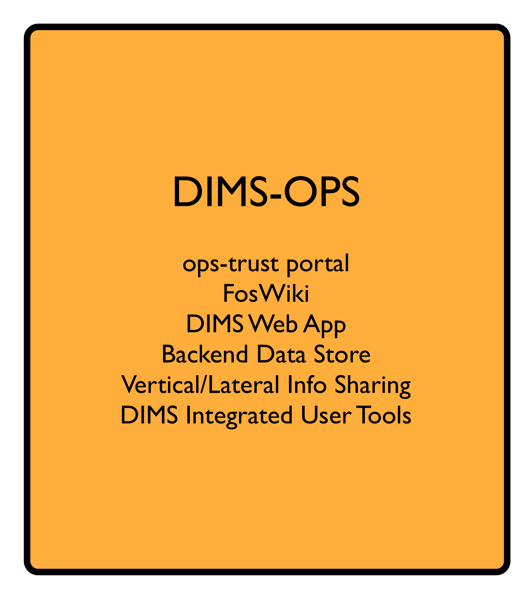

   DIMS Operations

..

.. dimsopscomponents:

.. list-table:: DIMS-OPS Components
   :widths: 50 50
   :header-rows: 1

   * - Component
     - CSCI/Requirement
   * - Trident portal and wiki
     - :ref:`dimssr:bdscsci`, :ref:`dimssr:designconstraints`
   * - LDAP Single-Signon
     - :ref:`dimssr:diutcsci`, :ref:`dimssr:networkAccessControls`
   * - OpenVPN
     - :ref:`dimssr:diutcsci`, :ref:`dimssr:networkAccessControls`
   * - DIMS Web App
     - :ref:`dimssr:dwacsci`
   * - Hadoop (HDFS), Elasticsearch, etc.
     - :ref:`dimssr:bdscsci`
   * - Tupelo
     - :ref:`dimssr:diutcsci`
   * - Anonymization
     - :ref:`dimssr:diutcsci`
   * - STIX input/output
     - :ref:`dimssr:vliscsci`

..

Adding in the realtime event data collection elements, known
as `DIMS-PISCES` is illustrated in Figure :ref:`dimsopspisces`. [#pisces]_

.. _dimsopspisces:

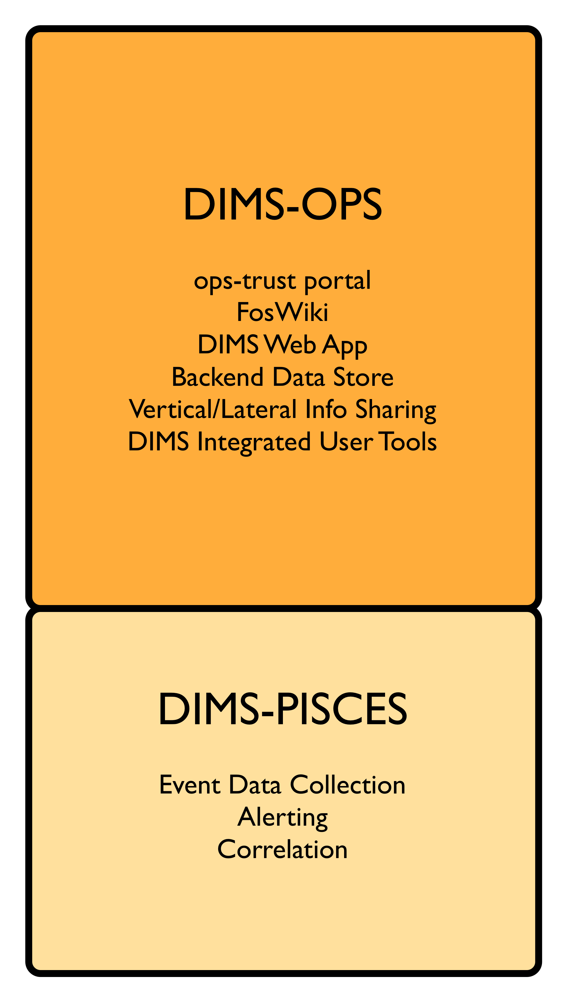

   DIMS Operations + PISCES

..

.. dimsiscescomponents:

.. list-table:: DIMS-PISCES Components
   :widths: 40 60
   :header-rows: 1

   * - Component
     - CSCI/Requirement
   * - Distributed Security Event Data Collection
     - :ref:`dimssr:bdscsci`
   * - Alerting
     - :ref:`dimssr:diutcsci`,
       :ref:`dimssr:dwacsci`
   * - Cross-organizational Correlation
     - :ref:`dimssr:diutcsci`,
       :ref:`dimssr:dwacsci`
   * - Customized User Documentation
     - :ref:`dimssr:adaptationreqs`
   * - Custom Configuration and Automated Deployment
     - :ref:`dimssr:adaptationreqs`,
       :ref:`dimssr:automatedprovisioning`,
       :ref:`dimssr:continuousintegration`

..

Finally, the DIMS team (or anyone wishing to develop DIMS from the open
source code base) requires all of the code development, configuration
management, and continuous integration (or `DevOps`) features necessary
for development. This is illustrated in Figure :ref:`dimsopspiscesdevops`.

.. _dimsopspiscesdevops:

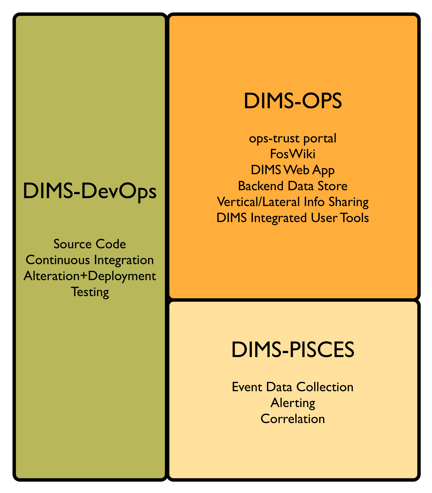

   DIMS Operations + PISCES + DevOps

..

.. dimsdevopscomponents:

.. list-table:: DIMS-DEVOPS Components
   :widths: 50 50
   :header-rows: 1

   * - Component
     - CSCI/Requirement
   * - Ops-trust portal
     - :ref:`dimssr:bdscsci`,
       :ref:`dimssr:designconstraints`
   * - Git source repository management
     - :ref:`dimssr:designconstraints`
   * - Jenkins Continuous Integration
     - :ref:`dimssr:designconstraints`
   * - Ansible configuration
     - :ref:`dimssr:designconstraints`
   * - Distributed configuration database
     - :ref:`dimssr:bdscsci`,
       :ref:`dimssr:designconstraints`
   * - Docker repository
     - :ref:`dimssr:bdscsci`,
       :ref:`dimssr:designconstraints`
   * - Jira ticketing
     - :ref:`dimssr:designconstraints`

..

For a pilot deployment of DIMS for the U.S. Secret Service, a full DIMS-OPS +
DIMS-PISCES deployment will be instantiated for a select subset of the PRISEM
participants in the Puget Sound to replicate a group of "victim" sites. Using
live data, an incident will be investigated and "reported" to a test "U.S.
Secret Service" DIMS-OPS system. This will validate the concept of reporting
machine-parsable data to a central site using the Vertical and Lateral
Information Sharing CSCI components (see :ref:`dimssr:vliscsci` and
:ref:`dimstp:dimstestplan`).

.. _ussspilot:

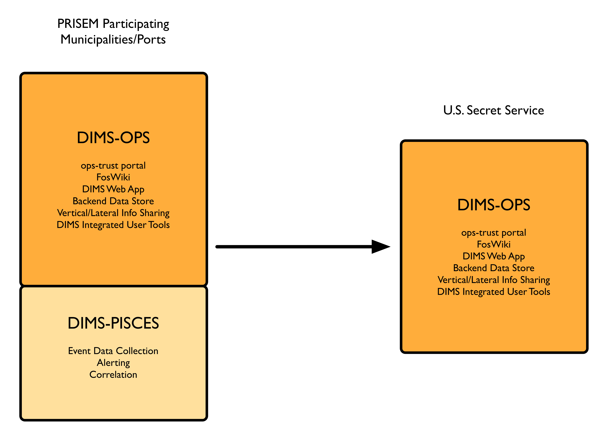

   U.S. Secret Service Pilot

..

.. rubric:: Footnotes

.. [#pisces] The term `PISCES` is the proposed replacement for `PRISEM` moving forward.

