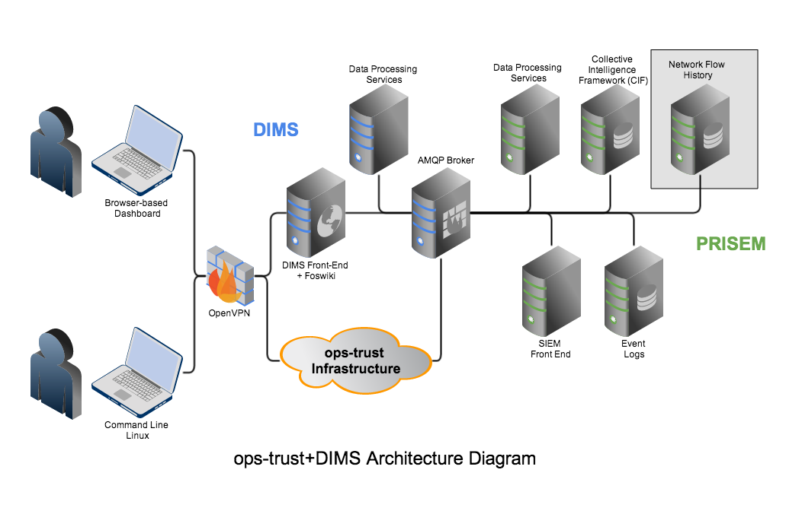
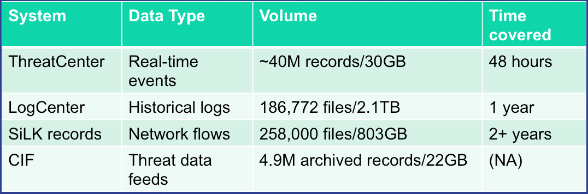
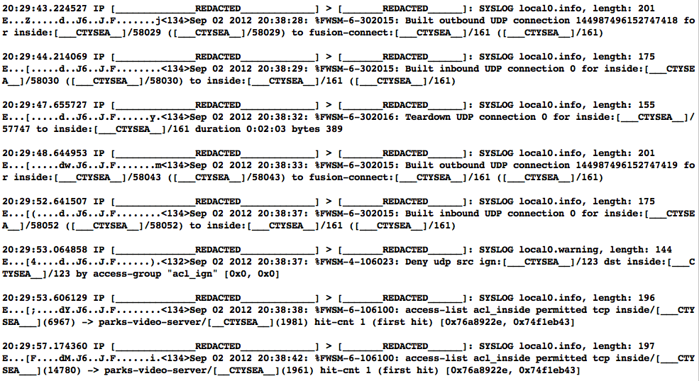
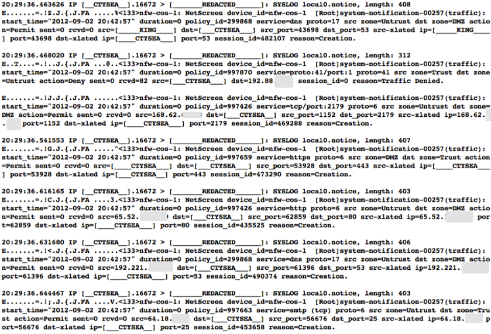
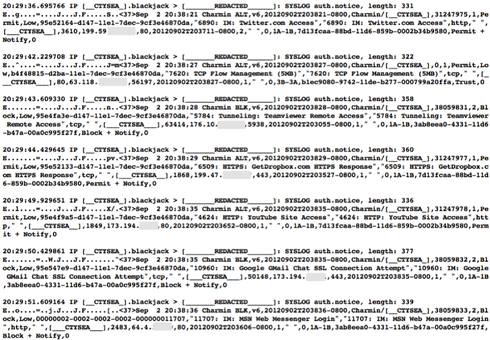
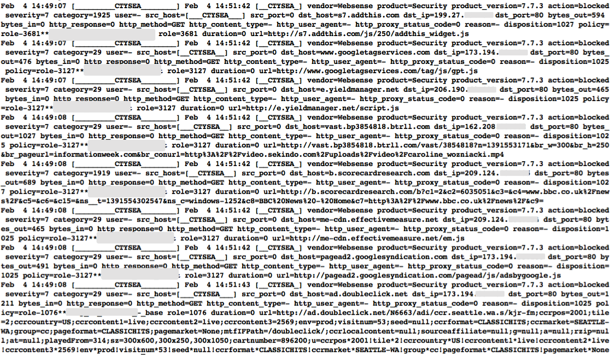
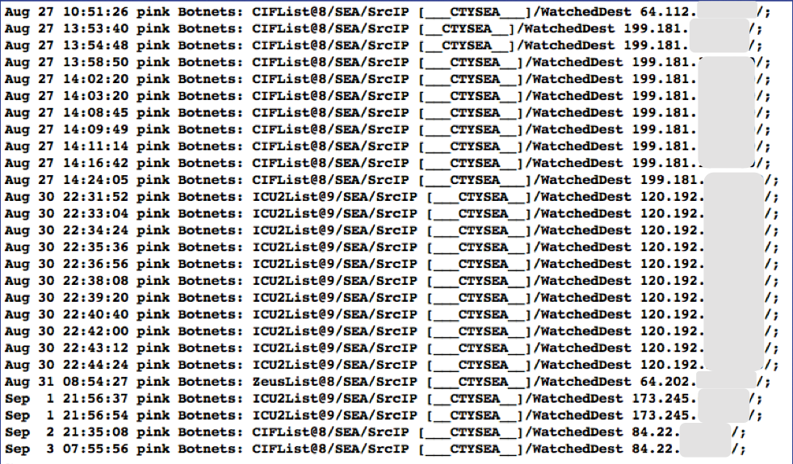
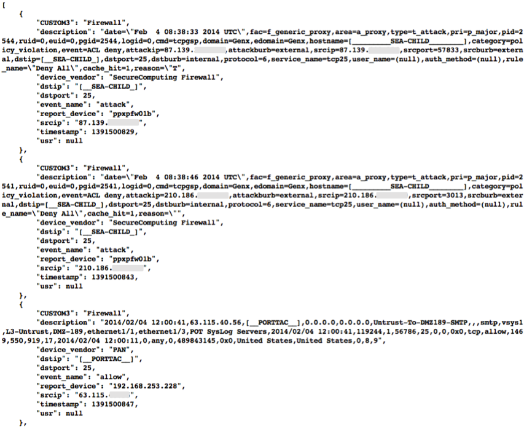
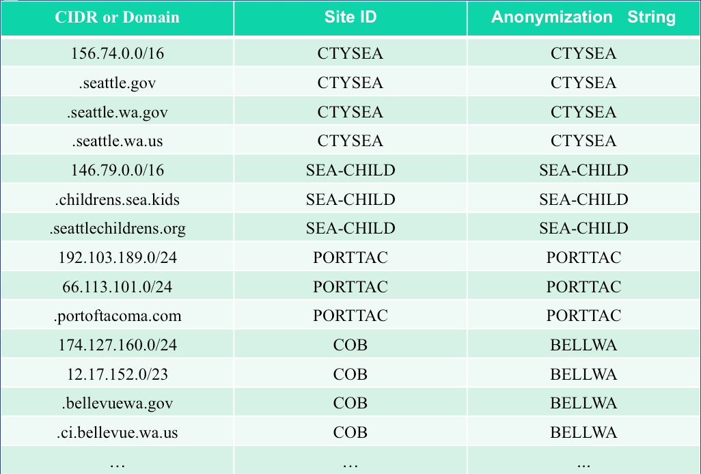
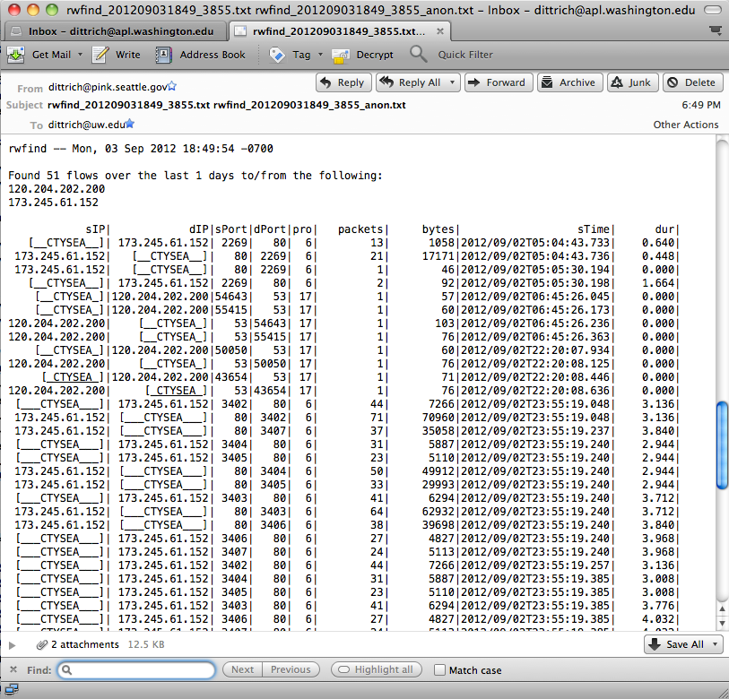

.. dimsarchitecturaldesign:

=========================
DIMS architectural design
=========================

.. note:: TBD

   This section shall be divided into the following paragraphs to
   describe the DIMS architectural design. If part or all of the design
   depends upon system states or modes, this dependency shall be
   indicated. If design information falls into more than one paragraph,
   it may be presented once and referenced from the other
   paragraphs. Design conventions needed to understand the design shall
   be presented or referenced.

.. _DIMSSystemArchitecture:

   DIMS Integrated System Architecture.

Figure :ref:`DIMSSystemArchitecture` illustrates the combined systems
of the PRISEM project, the Ops-Trust portal, and the DIMS back end. As
much as possible, the DIMS architecture will be overlaid on top of, or
merged into, similar components from these existing systems. For
example, it is not necessary to run three DNS servers for each
project, when one can handle multiple systems and possibly even
multiple domains. These can thus be collapsed into one server for
DNS. The same is true for LDAP and OpenID authentication (Ops-Trust
and DIMS are both designed to use these services) and there is only
need for one AMQP message bus server, one mail server, and one
database for security data. All access will be centralized through the
OpenVPN server, with certificates and encryption keys provided to the
user via the modified Ops-Trust portal.

System Hardware Architecture
----------------------------

.. _PRISEMHardwareLayoutDiagram:

.. figure:: images/PRISEM-hardware-layout-diagram.png
   :width: 70%
   :align: center

   PRISEM Hardware Layout Diagram.

Figure :ref:`PRISEMHardwareLayoutDiagram` shows the physical hardware
configuration for PRISEM system components in the server rack located
in the UW Tower IT data center. Green boxes are those used for PRISEM
(and now for some DIMS) related systems, while white and gray boxes
are either unused or occupied by other resources. Some of the physical
hardware (e.g., the systems labeled "IBM" and "Eclipse") are obsolete
and are being replaced by virtual machines to be housed in newly added
hardware located in slots 7+8. (The VLAN switch labeled "CoS" will
also be replaced in the near future with the D-Link VLAN switch below
it.) Hardware supporting the DIMS project has not yet been purchased,
though space has been reserved for it in the same rack to facilitate
high-speed network access behind the PRISEM firewall and OpenVPN
servers. (See other Figures for PRISEM + DIMS Architecture
descriptions).

The principal PRISEM hardware consists of Dell PowerEdge servers. Two
PowerEdge 1950 (pink.seattle.gov and floyd.prisem.washington.edu) are
used for log collection, NetFlow processing, and the CIF database. Two
Dell R720 (zion.prisem.washington.edu and money.prisem.washington.edu)
servers are used for the Log Matrix Threat Center and Log Center
servers. Both zion and money are replacements for the original Dell
R710 servers purchased at the start of the project in 2008. Virtual
machines are run on a Dell PowerEdge R715 server, with 128GB RAM,
2x12-Core 1.8GHz AMD Opteron processors, and 12 – 1TB drives in a RAID
5 array.

Physical networking is provided by 1 GigE switches, some configured to
support virtual LAN (VLAN) isolation. (One is a D-Link xStack Managed
24-Port Gigabit L2+ 1/10-GigE switch, another a D-Link DXS-3227 1-GigE
managed switch). One VLAN provides an isolated network for
inter-system communication behind a vendor-supported stateful firewall
and OpenVPN server for remote access. Another VLAN provides
internet-routable connections in front of the firewall. At present,
only IPv4 is supported for network connectivity

The DIMS system will conform with the hardware/software separation
used by the Ops-Trust and PRISEM systems, which pre-date the DIMS
project. In both of these projects, some separation of services across
physical and/or virtual machines is done for various reasons of
performance, scalability, speed, ease of administration, conformance
with operating system version dependencies, etc. DIMS components will
be separate (where appropriate) for similar reasons, and integrated as
much as possible by combining similar services in order to minimize
the total number of physical and/or virtual machines in use. For
example, if there are three domain name servers, they can be combined
into one server that handles multiple domains.

 .. dimscomponents:

System Software Architecture
----------------------------

The DIMS system will conform with the hardware/software separation
used by the Ops- Trust and PRISEM systems, which pre-date the DIMS
project. In both of these projects, some separation of services across
physical and/or virtual machines is done for various reasons of
performance, scalability, speed, ease of administration, conformance
with operating system version dependencies, etc. DIMS components will
be separate (where appropriate) for similar reasons, and integrated as
much as possible by combining similar services in order to minimize
the total number of physical and/or virtual machines in use.  For
example, if there are three domain name servers, they can be combined
into one server that handles multiple domains.

SIEM event correlation server
^^^^^^^^^^^^^^^^^^^^^^^^^^^^^

The PRISEM system uses a Log Matrix "Threat Center" system, hosted on
a high-end Dell server with multiple cores, large RAM capacity, an SSD
drive to accelerate database activities, and 2TB RAID 1 array for disk
fault tolerance. This system runs CentOS 6.4.

SIEM log archive server
^^^^^^^^^^^^^^^^^^^^^^^

The PRISEM system uses a Log Matrix "Log Center" system, hosted on a
high-end Dell server with multiple cores, and 9TB RAID 5 array disk
fault tolerance. This system runs CentOS 5.10 (due to compatibility
issues with the Vertica database).

Virtual machine management server
^^^^^^^^^^^^^^^^^^^^^^^^^^^^^^^^^

The PRISEM system uses a Dell PowerEdge R715 for virtual machine hosting.

AMQP broker
^^^^^^^^^^^

The PRISEM system uses a virtual machine running RabbitMQ for AMQP
broker services.

Collective Intelligence Framework (CIF) server
^^^^^^^^^^^^^^^^^^^^^^^^^^^^^^^^^^^^^^^^^^^^^^

The PRISEM system is using a CIF v0.1 database on physical hardware
(Dell PowerEdge 1950). This system will be replaced with a virtual
machine running CIF v1.0 (or newer).

ID management and authentication server
^^^^^^^^^^^^^^^^^^^^^^^^^^^^^^^^^^^^^^^

The Ops-Trust and DIMS projects are using OpenID and LemonLDAP (though
in slightly different ways). The intention is to combine these into a
single pair of OpenID/LDAP servers.

Domain name server
^^^^^^^^^^^^^^^^^^

The Ops-Trust system runs its own DNS server for all system components
in a single-purpose VM. The PRISEM project is currently using static
host tables and DNSMasq in slightly different ways (depending on
whether access is from the open internet, or through the OpenVPN
tunnel). It is anticipated that a split-DNS configuration, using the
same server as the Ops-Trust infrastructure, will be used in the long
run to get consistent DNS response regardless of access method used.

Virtual private network tunnel server(s)
^^^^^^^^^^^^^^^^^^^^^^^^^^^^^^^^^^^^^^^^

The PRISEM project has an OpenVPN server for remote access to the
backdoor VLAN. This allows access to the AMQP broker, and direct
access to the MySQL databases used by Log Matrix. (The vendor
maintains their own Cisco managed VPN/firewall for access from their
internal network).

Internal Communications Architecture
------------------------------------

.. note::

   In this section, describe the overall communications within the
   system; for example, LANs, buses, etc. Include the communications
   architecture(s) being implemented, such as X.25, Token Ring,
   etc. Provide a diagram depicting the communications path(s) between
   the system and subsystem modules. If appropriate, use subsections to
   address each architecture being employed.

The DIMS system will be built on top of the legacy PRISEM
system. PRISEM has interfaces to some of its services that integrate
an instance of the Collective Intelligence Framework (CIF) database
for IP-based reputation watchlists and historic attacker context, an
archive of historic event logs, and remotely stored network flow data
in SiLK format. The logical architecture that integrates these systems
is a combination of message bus (using AMQP), SSH tunneled file and/or
command line access, or HTTPS web interfaces and RESTful API.

.. note:: TBD

    This paragraph shall:

        * Identify the software units that make up the DIMS. Each software unit
          shall be assigned a project-unique identifier.

    .. note::

        A software unit is an element in the design of a DIMS; for example, a
        major subdivision of a DIMS, a component of that subdivision, a class,
        object, module, function, routine, or database. Software units may occur
        at different levels of a hierarchy and may consist of other software
        units. Software units in the design may or may not have a one-to-one
        relationship with the code and data entities (routines, procedures,
        databases, data files, etc.) that implement them or with the computer
        files containing those entities. A database may be treated as a DIMS or
        as a software unit. The SDD may refer to software units by any name(s)
        consistent with the design methodology being used.

    ..

        * Show the static (such as "consists of") relationship(s) of the software
          units. Multiple relationships may be presented, depending on the
          selected software design methodology (for example, in an
          object-oriented design, this paragraph may present the class and object
          structures as well as the module and process architectures of the
          DIMS).

        * State the purpose of each software unit and identify the DIMS
          requirements and DIMS-wide design decisions allocated to it.
          (Alternatively, the allocation of requirements may be provided in 6.a.)

        * Identify each software unit's development status/type (such as new
          development, existing design or software to be reused as is, existing
          design or software to be reengineered, software to be developed for
          reuse, software planned for Build N, etc.) For existing design or
          software, the description shall provide identifying information, such
          as name, version, documentation references, library, etc.

        * Describe the DIMS's (and as applicable, each software unit's) planned
          utilization of computer hardware resources (such as processor capacity,
          memory capacity, input/output device capacity, auxiliary storage
          capacity, and communications/network equipment capacity). The
          description shall cover all computer hardware resources included in
          resource utilization requirements for the DIMS, in system-level
          resource allocations affecting the DIMS, and in resource utilization
          measurement planning in the Software Development Plan. If all
          utilization data for a given computer hardware resource are presented
          in a single location, such as in one SDD, this paragraph may reference
          that source. Included for each computer hardware resource shall be:

            * The DIMS requirements or system-level resource allocations being
              satisfied

            * The assumptions and conditions on which the utilization data are
              based (for example, typical usage, worst-case usage, assumption of
              certain events)

            * Any special considerations affecting the utilization (such as use
              of virtual memory, overlays, or multiprocessors or the impacts of
              operating system overhead, library software, or other
              implementation overhead)

            * The units of measure used (such as percentage of processor
              capacity, cycles per second, bytes of memory, kilobytes per second)

            * The level(s) at which the estimates or measures will be made (such
              as software unit, DIMS, or executable program)

        * Identify the program library in which the software that implements each
          software unit is to be placed

..

.. conceptofexecution:

Concept of execution
--------------------

.. note:: TBD

   This paragraph shall describe the concept of execution among the software
   units. It shall include diagrams and descriptions showing the dynamic
   relationship of the software units, that is, how they will interact during
   DIMS operation, including, as applicable, flow of execution control, data
   flow, dynamically controlled sequencing, state transition diagrams, timing
   diagrams, priorities among units, handling of interrupts, timing/sequencing
   relationships, exception handling, concurrent execution, dynamic
   allocation/deallocation, dynamic creation/deletion of objects, processes,
   tasks, and other aspects of dynamic behavior.

.. interfacedesign:

Interface design
----------------

.. note:: TBD

   This paragraph shall be divided into the following subparagraphs to describe
   the interface characteristics of the software units. It shall include both
   interfaces among the software units and their interfaces with external
   entities such as systems, configuration items, and users. If part or all of
   this information is contained in Interface Design Descriptions (IDDs), in
   section 5 of the SDD, or elsewhere, these sources may be referenced.

File and Database Design
------------------------

.. _PRISEMDataVolumes:

   PRISEM Data Volumes

Figure :ref:`PRISEMDataVolumes` lists the database and non-database
data sources used by the PRISEM system, along with the approximate
timespan over which those records are kept.

Database Management System Files
--------------------------------

There is an approximate average of 20M events per day collected by the
ThreatCenter database server (zion.prisem.washington.edu), which is
configured with a 48-hour data retention window. These records are
kept in a database optimized for continuous correlation.  The
normalized records (which include the original raw event log) are
stored in over 167,000 discrete read-optimized Vertica database files
on the LogCenter server (money.prisem.washington.edu).  The Collective
Intelligence Framework database (v0.1) keeps its data in a Postgress
database. This database is used to pull feeds from remote sites, and
to generate feeds for use by the Botnets system’s watchlist
detectors. At regular periods during the day, the CIF database has
some tables copied into a read-optimized MySQL database known as
Sphinx for accelerated discrete queries. (It is the Sphinx database
that is used by the cifbulk RPC service).

Non-Database Management System Files
--------------------------------

Network flow records are stored locally at the City of Seattle
(pink.seattle.gov) in SiLK format. The disk capacity of 1TB is capable
of holding just over 2 years of flow data in over 258,000 discrete
SiLK data files. (SiLK is a highly-optimized fixed length binary
format that is quite efficient for post-processing without needing a
database management system.)

Human-Machine Interface
-----------------------

The raw inputs to PRISEM fall into three primary buckets: event logs
from security devices in text form, which are normalized as they are
processed by the SIEM; Network flow records that are received as
NetFlow V5 records processed in real time and discarded, but a copy is
converted to SiLK format and saved for historic query capability;
reputation data pulled from various feeds and stored in a Collective
Intelligence Framework (CIF) database. Various ad-hoc formats of
“indicators of compromise” or “observables” are received from outside
parties, which are primarily processed by hand (this includes
indicators received from federal government sources, for example Joint
Indicator Bulletins (JIBs) from the Federal Bureau of Investigation).

.. _CiscoFWSM:

   Cisco FWSM Event Log (Redacted)

Examples of standard security device logs can be seen in Figure
:ref:`CiscoFWSM` (Cisco Firewall Security Manager, or FWSM), Figure
:ref:`Netscreen` (Netscreen Firewall), Figure :ref:`TippingPoint`
(Tipping Point Intrusion Prevention System, or IPS), and Figure
:ref:`WebSense` (Websense web filter). These examples are redacted,
but show representative content that is used for correlation (e.g.,
source and destination IP addresses, ports, protocols, etc.)

.. _Netscreen:

   Netscreen Event Log (Redacted)

.. _TippingPoint:

   Tipping Point Logs (Redacted)

.. _WebSense:

   WebSense Log Sample (Redacted)

Figure :ref:`BotnetsSyslog` illustrates what events logged by the
Botnets system detectors look like. All of these examples are for
“watchlist” detectors that simply trigger when they see a connection
to/from a host on the watchlist. Each detector has its own ID (e.g,
“CIFList” in the first entry), followed by the ranking score for that
detector (“@8” in this case for the CIFList detector). This is used in
the calculation of score for ranking significance of events in the
SIEM. Also shown are the IP addresses of the internal hosts involved
in the alerted activity, as well as the IP addresses of the systems on
the watchlists.

.. _BotnetsSyslog:

   Botnets System Event Log (Redacted)

.. _HistoricEventLogs:

   Example Historic Event Log Data (Redacted)

Figure :ref:`HistoricEventLogs` shows three records returned from a
search of historic event logs from the Log Matrix SEIM log
archive. These records have been anonymized to conceal the specific IP
addresses and domain names of the sources (Seattle Children’s Hospital
and the Port of Tacoma, in this case). Notice that the schema used by
this vendor includes both destination IP address and destination port,
but only includes source IP address (not source port) making certain
queries of the database impossible. For example, attempting to find
records related to malware that uses fixed source port for flooding
could not be directly queried, requiring extraction of the
“description” field (i.e., the original raw event) and parsing to
identify related records. A solution to this would be to extract all
of the data from the database and store it in a more flexible
database.

Indirectly related to the previous data sources is meta-data that
allows classification, filtering, and anonymization, based on
organizational units for networks and sites. Figure
:ref:`ParticipantMapping` illustrates how top level domains and/or
CIDR blocks for a subset of PRISEM participants are mapped to their
Site ID strings and chosen anonymization strings (i.e., the label that
participant would like to use to mask their internal IP addresses and
host names in reports that are shared outside the trust group.) Their
use in identification of “Friend or Foe” is described in the Concept
of Operations document. (Such a cross- organizational correlation
result using the full map as suggested in Figure
:ref:`ParticipantMapping` can be seen in Figure TODO 21 in the Outputs
section.)

.. _ParticipantMapping:

   Partial Participant ID Mapping

.. _NetworkFlowReport:

   Example Network Flow Report (Anonymized Targets)

.. interfaceiddiagrams:

Interface identification and diagrams
-------------------------------------

.. note:: TBD

   This paragraph shall state the project-unique identifier assigned to each
   interface and shall identify the interfacing entities (software units,
   systems, configuration items, users, etc.) by name, number, version, and
   documentation references, as applicable. The identification shall state which
   entities have fixed interface characteristics (and therefore impose interface
   requirements on interfacing entities) and which are being developed or
   modified (thus having interface requirements imposed on them). One or more
   interface diagrams shall be provided, as appropriate, to depict the
   interfaces.

.. projectid_A:

(Project unique identifier of interface)
----------------------------------------

.. note:: TBD

    This paragraph (beginning with 4.3.2) shall identify an interface by project
    unique identifier, shall briefly identify the interfacing entities, and shall
    be divided into subparagraphs as needed to describe the interface
    characteristics of one or both of the interfacing entities. If a given
    interfacing entity is not covered by this SDD (for example, an external
    system) but its interface characteristics need to be mentioned to describe
    interfacing entities that are, these characteristics shall be stated as
    assumptions or as "When [the entity not covered] does this, [the entity that
    is covered] will . . . ." This paragraph may reference other documents (such
    as data dictionaries, standards for protocols, and standards for user
    interfaces) in place of stating the information here. The design description
    shall include the following, as applicable, presented in any order suited to
    the information to be provided, and shall note any differences in these
    characteristics from the point of view of the interfacing entities (such as
    different expectations about the size, frequency, or other characteristics of
    data elements):

        * Priority assigned to the interface by the interfacing entity(ies)

        * Type of interface (such as real-time data transfer, storage-and-retrieval of data, etc.) to be implemented

        * Characteristics of individual data elements that the interfacing entity(ies) will provide, store, send, access, receive, etc., such as:

            * Names/identifiers

            * Project-unique identifier

            * Non-technical (natural-language) name

            * DoD standard data element name

            * Technical name (e.g., variable or field name in code or database)

            * Abbreviation or synonymous names

            * Data type (alphanumeric, integer, etc.)

            * Size and format (such as length and punctuation of a character string)

            * Units of measurement (such as meters, dollars, nanoseconds)

            * Range or enumeration of possible values (such as 0-99)

            * Accuracy (how correct) and precision (number of significant digits)

            * Priority, timing, frequency, volume, sequencing, and other constraints, such as whether the data element may be updated and whether business rules apply

            * Security and privacy constraints

            * Sources (setting/sending entities) and recipients (using/receiving entities)

        * Characteristics of data element assemblies (records, messages, files, arrays, displays, reports, etc.) that the interfacing entity(ies) will provide, store, send, access, receive, etc., such as:

     	* Names/identifiers

                * Project-unique identifier

                * Non-technical (natural language) name

                * Technical name (e.g., record or data structure name in code or database)

                * Abbreviations or synonymous names

        * Data elements in the assembly and their structure (number, order, grouping)

        * Medium (such as disk) and structure of data elements/assemblies on the medium

        * Visual and auditory characteristics of displays and other outputs (such as colors, layouts, fonts, icons and other display elements, beeps, lights)

        * Relationships among assemblies, such as sorting/access characteristics

        * Priority, timing, frequency, volume, sequencing, and other constraints, such as whether the assembly may be updated and whether business rules apply

        * Security and privacy constraints

        * Sources (setting/sending entities) and recipients (using/receiving entities)

        * Characteristics of communication methods that the interfacing entity(ies) will use for the interface, such as:

            * Project-unique identifier(s)

            * Communication links/bands/frequencies/media and their characteristics

            * Message formatting

            * Flow control (such as sequence numbering and buffer allocation)

            * Data transfer rate, whether periodic/aperiodic, and interval between transfers

            * Routing, addressing, and naming conventions

            * Transmission services, including priority and grade

            * Safety/security/privacy considerations, such as encryption, user authentication, compartmentalization, and auditing

        * Characteristics of protocols that the interfacing entity(ies) will use for the interface, such as:

            * Project-unique identifier(s)

            * Priority/layer of the protocol

            * Packeting, including fragmentation and reassembly, routing, and addressing

            * Legality checks, error control, and recovery procedures

            * Synchronization, including connection establishment, maintenance, termination

            * Status, identification, and any other reporting features

        * Other characteristics, such as physical compatibility of the
          interfacing entity(ies) (dimensions, tolerances, loads, voltages, plug
          compatibility, etc.)

..
