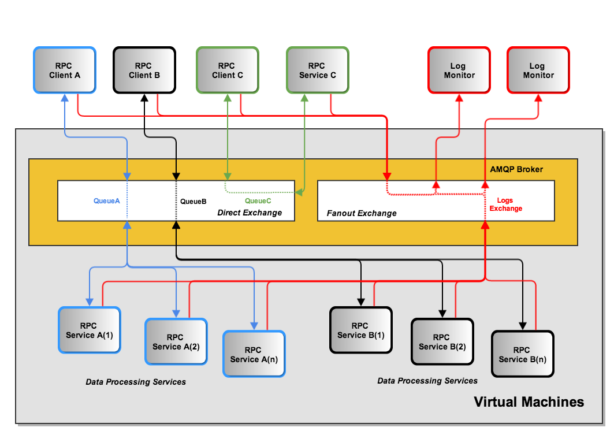
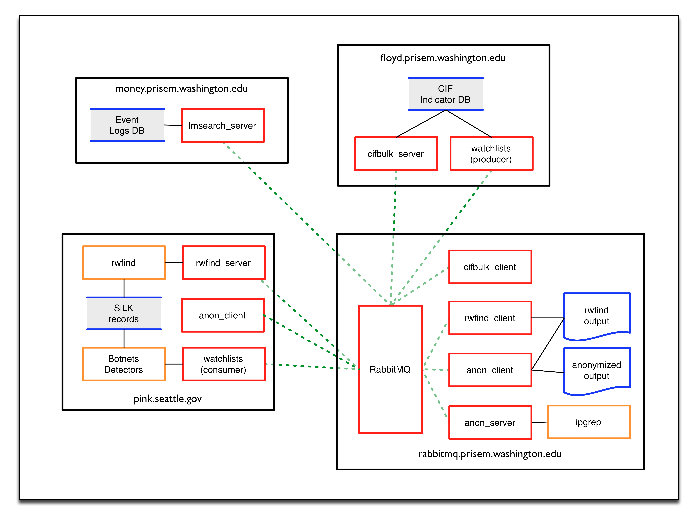

.. dimsdetaileddesign:

====================
DIMS detailed design
====================

Hardware Detailed Design
------------------------

Software Detailed Design
------------------------

There are several services available within the PRISEM architecture as
Remote Procedure Call (RPC) services, with some data distribution and
feedback mechanisms in the form of publish/subscribe fanout
services. These are:

* RPC service “rwfind” – This service provides search capability to
  stored network flow records kept in SiLK tools format. It returns the
  results in text report format for human consumption, or in structured
  JSON format for simplified processing by programs.
  
* RPC service “anon” – This service provides IP address and DNS name
  identification/anonymization/extraction, statistics, match/non-match
  identification, and other functions, using the ipgrep script. This
  service is called as part of the "crosscor" service in order to
  identify friend or foe.
  
* RPC service “cifbulk” – This service front-ends the Sphinx database
  accelerator, which provides a read-only snapshot of the CIF database
  for a 10:1 speed increase for queries. It takes as input a list of
  items to search for, and iterates over the list of items it is passed
  concatenating the results (which are JSON by design) into a JSON
  array.
  
* RPC service “lmsearch” – This service front-ends the Log Matrix
  historic event log database, allowing historic queries for specific
  time periods. The results are returned as a JSON structure
  
* RPC service “crosscor” – This service performs cross-organizational
  correlation on search results obtained from the rwfind, lmsearch, and
  cifbulk services.
  
* Watchlist generation – Currently, a scheduled script produces
  watchlist files from CIF feeds and distributes them to systems that
  use the watchlists via rsync over SSH tunnels. These will be replaced,
  eventually, with publish/subscribe services via AMQP.
  
* Daily reports from the Botnets system – Currently, a scheduled script
  generates daily reports that summarize the detected activity by the
  Botnets system. This text report will be enriched with context
  provided by the “cifbulk” service, the “crosscor” service, and the
  identify friend or foe mechanism. This will be a model for a suite of
  DIMS scheduled reports.

Features that are required to support data sharing, role-based access
control, single- signon, etc., include:

* An OpenID authentication and LDAP directory service that is used by
  all DIMS components to extend a single login mechanism (centered on
  the user attributes in accounts in the Ops-Trust portal system).
  
* Use of encryption keys for users and groups (or other high-level
  organizational units) to encrypt data to be transferred between
  systems, to timestamp and sign files, and to maintain “chain of
  custody” for digital data.
  
* Management of data using abstract high-level organizational units that
  supports trust group operations, maintaining information relationships
  in campaign or investigation groupings over time, and allowing users
  to track incidents and campaign level activity over time. As users
  generate data, reports, query results, etc., the ability to tag this
  data to keep it organized should easily be at hand.

.. note:: TBD

   This section shall be divided into the following paragraphs to describe each
   software unit of the CSCI. If part of all of the design depends upon system
   states or modes, this dependency shall be indicated. If design information
   falls into more than one paragraph, it may be presented once and referenced
   from the other paragraphs. Design conventions needed to understand the design
   shall be presented or referenced. Interface characteristics of software units
   may be described here, in Section 4, or in Interface Design Descriptions
   (IDDs). Software units that are databases, or that are used to access or
   manipulate databases, may be described here or in Database Design Descriptions (DBDDs).

Internal Communications Detailed Design
------------------------

.. _MessageBus:

   AMQP Messaging Bus Architecture

Figure :ref:`MessageBus` shows the general flow of commands and logged
events from clients and services used in the PRISEM system for
inter-process communication between system components. In this
example, there are three general RPC services named A, B, and C.
Calls from remote clients A (color blue) and B (color black) are
processed by one of n instances of multiprocessing service daemons on
the same hardware as the AMQP broker (by multiple processes or virtual
machines). Client C in this diagram (color green) is also a remote
client, as is the RPC service C. (The AMQP broker and RPC mechanism
allows these programs to run anywhere we want.) Also depicted in this
diagram is an event feedback loop (color red). All clients and
services log significant events such as process startup, process end,
time taken to process RPC calls, or even more fine-grained debugging
output to assist developers. These events logs are published to a
fanout exchange, which distributes the events to any subscribers who
wish to consume them.

.. _PRISEMAMQP:

   PRISEM AMQP Data Flows

(Project-unique identifier of a software unit, or designator of a group of software units)
------------------------------------------------------------------------------------------

.. note:: TBD

   This paragraph shall identify a software unit by project-unique identifier and
   shall describe the unit. The description shall include the following
   information, as applicable. Alternatively, this paragraph may designate a group
   of software units and identify and describe the software units in
   subparagraphs. Software units that contain other software units may reference
   the descriptions of those units rather than repeating information.

       * Unit design decisions, if any, such as algorithms to be used, if not previously selected

       * Any constraints, limitations, or unusual features in the design of the software unit

       * The programming language to be used and rationale for its use if other than the specified CSCI language

       * If the software unit consists of or contains procedural commands (such as
	 menu selections in a database management system (DBMS) for defining forms
	 and reports, on-line DBMS queries for database access and manipulation,
	 input to a graphical user interface (GUI) builder for automated code
	 generation, commands to the operating system, or shell scripts), a list
	 of the procedural commands and reference to user manuals or other
	 documents that explain them.

       * If the software unit contains, receives, or outputs data, a description
	 of its inputs, outputs, and other data elements and data element
	 assemblies, as applicable. Paragraph 4.3.x of this DID provides a list of
	 topics to be covered, as applicable. Data local to the software unit
	 shall be described separately from data input to or output from the
	 software unit. If the software unit is a database, a corresponding
	 Database Design Description (DBDD) shall be referenced; interface
	 characteristics may be provided here or by referencing section 4 or the
	 corresponding Interface Design Description(s).

       * If the software unit contains logic, the logic to be used by the software unit, including, as applicable:

	   * Conditions in effect within the software unit when its execution is initiated

	   * Conditions under which control is passed to other software units

	   * Response and response time to each input, including data conversion, renaming, and data transfer operations

	   * Sequence of operations and dynamically controlled sequencing during the software unit's operation, including:

	       * The method for sequence control

	       * The logic and input conditions of that method, such as timing variations, priority assignments

	       * Data transfer in and out of memory

	       * The sensing of discrete input signals, and timing relationships between interrupt operations within the software unit

       * Exception and error handling
