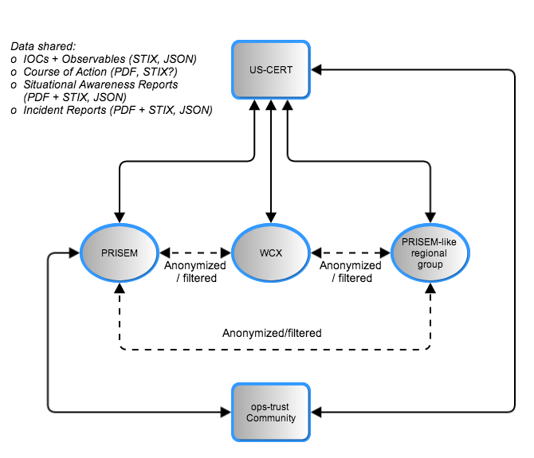

.. scope:

=====
Scope
=====

Identification
--------------

This paragraph shall contain a full identification of the system and the
software to which this document applies, including, as applicable,
identification number(s), title(s), abbreviation(s), version number(s), and
release number(s).

This document describes the proposed high-level design of the
Distributed Incident Management System (DIMS) architecture. Its
purpose is to provide the reader with an overview of the major system
components of the existing Public Regional Information Security Event
Management (PRISEM) system, the Operational Security Trust (Ops-Trust)
portal system, and the components of the DIMS `dashboard‘ front-end
and data processing back end that integrate these two existing
systems.

As the DIMS system relies upon and integrates multiple existing and
future open source software components, it is being developed using an
Agile programming development methodology (as opposed to the classic
`waterfall‘ development methodology with its sequential processes.)
This document, therefore, is a `living document‘ that will be updated
as the project proceeds and as cyclic input/feedback from users and
testers is received. Sections to be addressed in future releases of
this document are listed as TBA.

The scope of this document is limited to description of the
architectural elements, data types (and their sources, volumes, and
retention periods), data flows, user interfaces, etc. It is assumed
the reader is familiar with the underlying motivations for the system
as described in the Concept of Operations and Functional Requirements
document.

System overview
---------------

This paragraph shall briefly state the purpose of the system and the
software to which this document applies. It shall describe the general
nature of the system and software; summarize the history of system
development, operation, and maintenance; identify the project sponsor,
acquirer, user, developer, and support agencies; identify current and
planned operating sites; and list other relevant documents.

.. _DimsSystemOverview:

.. figure:: images/Overview-DIMS-system.png

   Overview of DIMS System.

Figure :ref:`DimsSystemOverview` depicts a high-level diagram of the
system architecture for the DIMS system. DIMS provides a user
interface layer on the front end, as well as a data processing layer
on the back end, that integrates with two existing systems.

The first is the Security Information Event Management (SIEM) system
at the core of the PRISEM project, and the technologies associated
with it to perform behavioral detection of malicious activity from
network flow data and support forensic analysis of historic data to
respond and recover from attacks that evade detective mechanisms. This
system collects and processes security related events and network flow
data and supports a collective approach to responding and recovering
from security events.

The second system is the Ops-Trust portal system, used by a community
of several hundred computer security professionals with operational
and research roles in industry, government, and academia. This system
is primarily designed to facilitate trust group maintenance and
communication to deal with emerging threats and events of
international scope.

The DIMS software will bring these two systems together into a
collaborative environment for shared analysis and shared response of
shared threats, both within a regional trust community, as well as
across multiple such trust communities in other regions. Through
vertical sharing of indicators of compromise from US-CERT to the
regional level, and lateral sharing across regional entities, the
objective is to scale actionable information sharing to state, local,
territorial, and tribal (SLTT) government entities across the United
States, and extend the sharing to international trust groups who make
up the global fabric of the internet.

.. _DataFlowsBetweenStakeholders:

   Data Flows Between Stakeholders

Figure :ref:`DataFlowsBetweenStakeholders` depicts the data flows
between a subset of the stakeholders who will be using the DIMS
software system. The solid lines depict data that has the highest
degree of sensitivity and trust, often being transmitted in
un-redacted form (possibly tagged with TLP indicators for most
restricted sharing). The dashed lines depict data flows that are at
lower levels of trust, and may be transmitted only in redacted form
(possibly tagged with TLP indicators for the least restricted
sharing). The type of data shared may be structured IOC and
Observables in STIX format, Course of Action information in either PDF
or structured format, `Situational Awareness Reports` (SITREP)
documents that describe observed campaign level activity at a high
level, possibly with structure data containing IOCs or Observables to
assist recipients in searching for related activity, and incident
reports that may similarly be a combination of human-readable PDF and
machine-readable IOCs/Observables. There are two types of data that
will be shared in most use cases: high-frequency, high-volume,
automated data feeds of `reputation` data and IOCs/Observables coming
from analytic and research groups; low-frequency, low-volume, manually
triggered bundles of IOCs/Observables, Course of Action information,
and/or high-level Situational Awareness Reports (SITREPs) for specific
incident-level up to campaign-level activity. The DIMS software,
layered on top of the Ops-Trust portal system, will facilitate
production of these reports and transmission/reception of structure
data files and facilitate automated processing of the structure data
files to pre-process data for an analyst to consume when ready, rather
than forcing the analyst to do a lot of work manipulating files,
processing their contents, and manually entering data into report
generation front ends in web based portals.

Document overview
-----------------

This paragraph shall summarize the purpose and contents of this document and
shall describe any security or privacy considerations associated with its
use.
